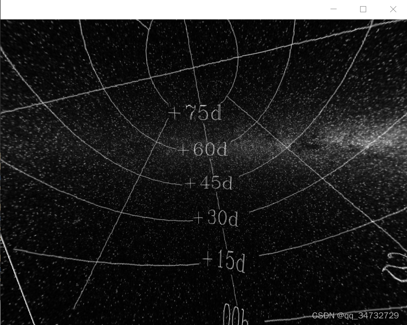
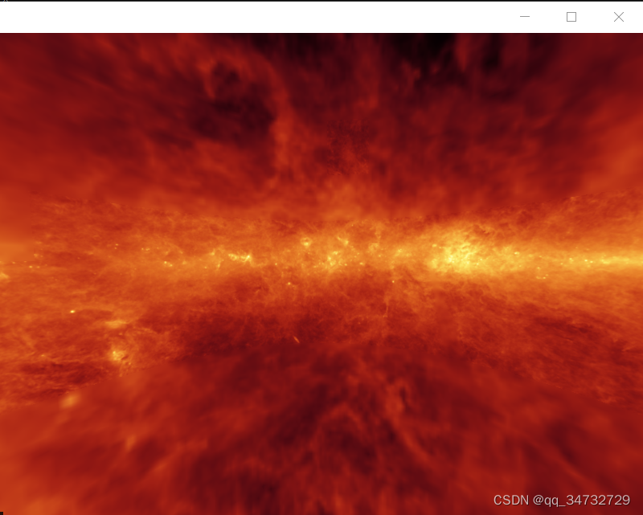
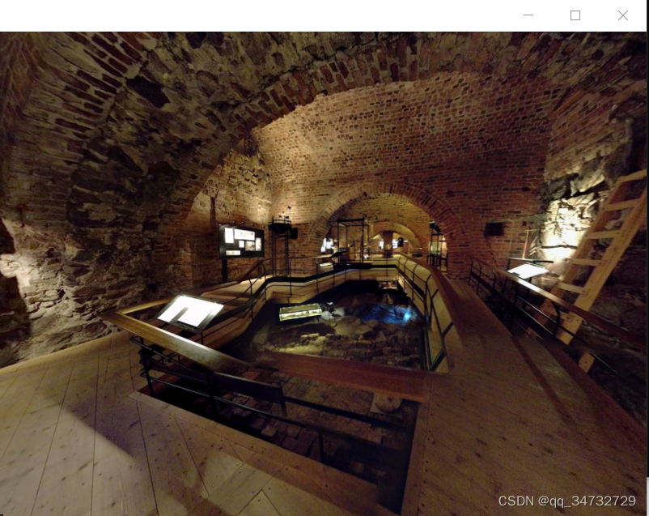
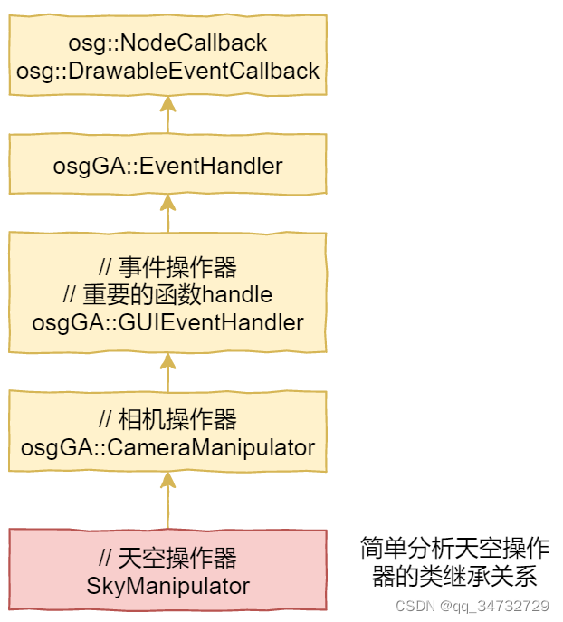

# 1.osgEarth示例分析——osgearth_skyview
原创 于 2022-11-29 12:19:21 发布 
原文链接：https://blog.csdn.net/qq_34732729/article/details/128044171

## 前言
本示例分析osgearth操作深空场景，或者是银河系场景，可以想象人拿着相机站在地球表面上观看天空/银河系的场景。

**重点是相机操作器的使用。**

在命令框输入执行程序，在data路径下有加载的图，且被写入了earth文件。
```sh
# // 两个文件仅加载图片不同
osgearth_skyviewd.exe ..\..\..\tests\skyview1.earth
osgearth_skyviewd.exe ..\..\..\tests\skyview2.earth
```

## 运行结果

天球场景。





第三幅图，特别像带VR眼镜，周围可以看到不同的场景，相机此时像站在十字路口，看周围的场景。

## 类分析
 

 重点就是处理handle的操作器。下面4个函数，必须要重写。
```cpp
virtual void setByMatrix(const osg::Matrixd& matrix);
    
virtual void setByInverseMatrix(const osg::Matrixd& matrix);
 
virtual osg::Matrixd getMatrix() const;
 
virtual osg::Matrixd getInverseMatrix() const;
```
## 代码分析
仅将操作器的实现文件和主程序文件拷贝到此处。

osgearth_skyview.cpp文件
```cpp
#include <osgViewer/Viewer>
#include <osg/CullFace>
#include <osgEarth/Notify>
#include <osgEarthUtil/ExampleResources>
#include "SkyManipulator"
 
 
#define LC "[viewer] "
 
using namespace osgEarth;
using namespace osgEarth::Util;
 
int
usage(const char* name)
{
    OE_NOTICE 
        << "\nUsage: " << name << " file.earth" << std::endl
        << MapNodeHelper().usage() << std::endl;
 
    return 0;
}
 
int
main(int argc, char** argv)
{
    osg::ArgumentParser arguments(&argc,argv);
 
    // help?
    if ( arguments.read("--help") )
        return usage(argv[0]);
 
    // Increase the fov to provide a more immersive experience.
	// 增加fov值以提供更沉浸的体验。vfov:视野(Field of View),通常设置45度
	// 如果想要一个末日风格的结果，可以将其设置一个更大的值
    float vfov = 100.0f;
    arguments.read("--vfov", vfov); // 也可以支持命令行输入
 
    // create a viewer:
    osgViewer::Viewer viewer(arguments);
 
    // Tell the database pager to not modify the unref settings 不修改任何设置
    viewer.getDatabasePager()->setUnrefImageDataAfterApplyPolicy( false, false );
 
    // thread-safe initialization of the OSG wrapper manager. Calling this here
    // prevents the "unsupported wrapper" messages from OSG
	// 获取 图片 包装管理器
    osgDB::Registry::instance()->getObjectWrapperManager()->findWrapper("osg::Image");
 
    // disable the small-feature culling
    viewer.getCamera()->setSmallFeatureCullingPixelSize(-1.0f);
 
    // set a near/far ratio that is smaller than the default. This allows us to get
    // closer to the ground without near clipping. If you need more, use --logdepth
    viewer.getCamera()->setNearFarRatio(0.0001);
 
    if ( vfov > 0.0 )
    {
        double fov, ar, n, f;
        viewer.getCamera()->getProjectionMatrixAsPerspective(fov, ar, n, f);// 获取到透视矩阵的各个参数
        viewer.getCamera()->setProjectionMatrixAsPerspective(vfov, ar, n, f);// 重新设置透视矩阵的各个参数
    }
 
    // load an earth file, and support all or our example command-line options
    // and earth file <external> tags    
    osg::Node* node = MapNodeHelper().load( arguments, &viewer );
 
    //Set our custom manipulator
    viewer.setCameraManipulator(new SkyManipulator());// 天空的操作器，继承自osgGA::CameraManipulator的操作器
    //viewer.setCameraManipulator( new osgGA::FirstPersonManipulator() ); 
    
    if ( node )
    {
        // Disable backface culling
       node->getOrCreateStateSet()->setMode(GL_CULL_FACE, osg::StateAttribute::OFF | osg::StateAttribute::OVERRIDE);
 
 
        viewer.setSceneData( node );
        while(!viewer.done())
        {
            viewer.frame();            
        }
    }
    else
    {
        return usage(argv[0]);
    }
}
```
