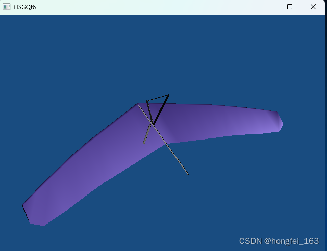

# 1.QT+osg+osgearth显示一个地球（进阶）
原创 于 2024-11-20 14:10:32 发布
原文链接：https://blog.csdn.net/Jinyizhi2233/article/details/143904310


        曾经我有一个版本，是用的别人的封装好的dll和lib，但是这样无法满足在liunx系统或者别的国产操作系统比如银河麒麟上跑这个程序。

        于是在网上查了很多资料，终于实现了我的需求，一般在其他系统上运行的osg+osgearth是比较好编译的，但是osgqt在osgearth3.0版本就没有了，在网上找了好久，终于找到了可以运行的源码，直接.h和.cpp的加入到项目中，这样就不影响在liunx系统上运行。

运行结果：


## 1.配置环境
QT版本：5.15.2   编译器：MSVC2019   64bit

编辑器：QT  Creator  大家也可以用vs2019或者2022一样的。

OSG版本3.6.5  x64   osg-earth3.0

## 2.库的导入
      我是在qt ceartor中以外部库的形式导入的，目前项目主要还是运行在win10系统上,pro文件

### GDAL 库
win32:CONFIG(release, debug|release): LIBS += -L$$PWD/../OSG3.6.5_X64/3rdparty/lib/ -lgdal_i
else:win32:CONFIG(debug, debug|release): LIBS += -L$$PWD/../OSG3.6.5_X64/3rdparty/lib/ -lgdal_id
else:unix: LIBS += -L$$PWD/../OSG3.6.5_X64/3rdparty/lib/ -lgdal_i
 
INCLUDEPATH += $$PWD/../OSG3.6.5_X64/3rdparty/include
DEPENDPATH += $$PWD/../OSG3.6.5_X64/3rdparty/include
 
 
### OSG 核心库
win32:CONFIG(release, debug|release): LIBS += -L$$PWD/../OSG3.6.5_X64/osg365/lib/ -losg -losgViewer -losgDB -losgGA  -lOpenThreads -losgUtil -losgWidget   -losgAnimation  -losgFX  -losgManipulator  -losgParticle  -losgShadow  -losgSim  -losgTerrain  -losgText
else:win32:CONFIG(debug, debug|release): LIBS += -L$$PWD/../OSG3.6.5_X64/osg365/lib/ -losgd -losgViewerd -losgDBd -losgGAd  -lOpenThreadsd  -losgUtild -losgWidgetd  -losgAnimationd  -losgFXd -losgManipulatord -losgParticled -losgShadowd -losgSimd -losgTerraind  -losgTextd
else:unix: LIBS += -L$$PWD/../OSG3.6.5_X64/osg365/lib/ -losg -losgViewer -losgDB -losgGA   -lOpenThreads  -losgUtil -losgWidget  -losgAnimation  -losgFX  -losgManipulator  -losgParticle  -losgShadow -losgSim -losgTerrain  -losgText
 
INCLUDEPATH += $$PWD/../OSG3.6.5_X64/osg365/include
DEPENDPATH += $$PWD/../OSG3.6.5_X64/osg365/include
 
 
### OSG-Earth 核心库
win32:CONFIG(release, debug|release): LIBS += -L$$PWD/../OSG3.6.5_X64/osgearth-3.2/lib/ -losgEarth
else:win32:CONFIG(debug, debug|release): LIBS += -L$$PWD/../OSG3.6.5_X64/osgearth-3.2/lib/ -losgEarthd
else:unix: LIBS += -L$$PWD/../OSG3.6.5_X64/osgearth-3.2/lib/ -losgEarth
 
INCLUDEPATH += $$PWD/../OSG3.6.5_X64/osgearth-3.2/include
DEPENDPATH += $$PWD/../OSG3.6.5_X64/osgearth-3.2/include
AI写代码
3、添加三个关于osgqt的h和cpp


关于这三个文件的资源：通过网盘分享的文件：osgqt
链接: https://pan.baidu.com/s/1gvleKqNxgJnVC6uY4u1kDw 提取码: 6658 
--来自百度网盘超级会员v7的分享

找不到这个人写的文章衔接了，只好放自己的百度网盘。

## 4.界面


拖了一个widget进行栅格布局，这样球就是随着界面大小的变化而变化。

注意：不进行栅格布局会报错。

将osg的球嵌入到qt的一个界面中，跟qchart中的图表有些类似，都是需要一个widget进行装的而且需要进行布局，而不是直接使用的当前的ui界面。

如果继承的界面是QMainWindow,就不一样，QMainWindow有一个函数可以 this->setCentralWidget(osg_widget);

## 4、代码
```.h

#ifndef AMAINWIDGET_H
#define AMAINWIDGET_H
 
#include <QWidget>
#include "osgqt/GraphicsWindowQt.h"
 
#include <QTimer>
#include <osgDB/ReadFile>
#include <osg/Group>
#include <osg/Node>
#include <osg/Camera>
#include <osg/PositionAttitudeTransform>
#include <osgGA/TrackballManipulator>
#include <osgGA/StateSetManipulator>
#include <osgViewer/ViewerEventHandlers>
 
#include <osgEarth/MapNode>
#include <osgEarth/SpatialReference>
 
#include <osgEarth/GeoTransForm>
#include <osgEarth/GeoCommon>
#include <osgEarth/SpatialReference>
#include <osgEarth/EarthManipulator>
#include <osgEarth/Ephemeris>
#include <osgEarth/Sky>
 
#include <osgUtil/Tessellator>
#include <osgEarth/GLUtils>
#include <osg/Geode>
#include <osg/Geometry>
#include <osg/TexGen>
 
#include <QApplication>
#include <QDir>
#include <QString>
 
namespace Ui {
class amainWidget;
}
 
class amainWidget : public QWidget
{
    Q_OBJECT
 
public:
    explicit amainWidget(QWidget *parent = nullptr);
    ~amainWidget();
 
private:
    Ui::amainWidget *ui;
 
private:
    QTimer* _timer;		// 计时器，每5ms触发一次事件
    osgViewer::Viewer* viewer;
    osg::ref_ptr<osg::Group> root;
    osg::ref_ptr<osg::Camera> camera;
    osg::ref_ptr<osg::Node> earthNode;
    osg::ref_ptr<osgEarth::MapNode> mapNode;
    osg::ref_ptr <osg::MatrixTransform> earthForm;
    osg::ref_ptr<osgEarth::EarthManipulator> em;
    tm* t_tm;
    osgEarth::SkyNode* m_pSkyNode;
    time_t now_time;
 
private:
    void InitOSG();// 初始化设置osg
    void InitUI();//界面初始化
    void InitTimer();//屏幕刷新初始化
    void InitOsgearth();//初始化osgearth
    void InitSky();//天空初始化
private slots:
    // 定时更新帧的槽函数
    void updateFrame();
 
};
 
#endif // AMAINWIDGET_H
```

```cpp

#include "amainwidget.h"
#include "ui_amainwidget.h"
 
amainWidget::amainWidget(QWidget *parent) :
    QWidget(parent),
    ui(new Ui::amainWidget)
{
    ui->setupUi(this);
    InitOSG();
    InitOsgearth();
    InitUI();
    InitTimer();
 
}
 
amainWidget::~amainWidget()
{
    delete ui;
}
 
void amainWidget::InitOSG()// 初始化设置osg
{
    viewer = new osgViewer::Viewer;
    // 设置模型
    root = new osg::Group;
 
 
    QString exeDir = QCoreApplication::applicationDirPath();
    QDir::setCurrent(exeDir);
    // 显示 .earth 文件中的地球模型
 
        // 使用相对于exe的相对路径来构建.earth文件的完整路径
 
    earthNode = new osg::Node;
 
    QString relativeEarthFilePath = "Maps/ocean.earth";  // 请替换为你实际的.earth文件相对路径
    QString earthFilePath = exeDir + "/" + relativeEarthFilePath;
   // QString earthFilePath ="./simple.earth";
    earthNode = osgDB::readNodeFile(earthFilePath.toStdString());
 
    //获取屏幕分辨率 长宽
    osg::GraphicsContext::WindowingSystemInterface* wsi = osg::GraphicsContext::getWindowingSystemInterface();
    if (!wsi)
        return;
    unsigned int width, height;
    wsi->getScreenResolution(osg::GraphicsContext::ScreenIdentifier(0), width, height);
    //设置图形环境特性
    osg::ref_ptr<osg::GraphicsContext::Traits> traits = new osg::GraphicsContext::Traits;
    traits->windowDecoration = false;//声明是否显示窗口的描述
    traits->x = 0;
    traits->y = 0;
    traits->width = width;
    traits->height = height;
    traits->doubleBuffer = true;//创建图形窗口是否使用双缓存
 
    //设置照相机
    camera = new osg::Camera;
    camera->setGraphicsContext(new osgQt::GraphicsWindowQt(traits.get()));
    camera->setClearColor(osg::Vec4(0.2, 0.2, 0.6, 1.0));
    camera->setViewport(new osg::Viewport(0, 0, width, height));
    camera->setProjectionMatrixAsPerspective(30.0f, (double(traits->width)) / (double(traits->height)), 1.0f, 10000.0f);
 
    //设置渲染器
    viewer->setCamera(camera);
    viewer->setSceneData(root);
    viewer->setThreadingModel(osgViewer::Viewer::SingleThreaded);//创建为单线程
    viewer->addEventHandler(new osgGA::StateSetManipulator(viewer->getCamera()->getOrCreateStateSet()));
}
void amainWidget::InitOsgearth()
{
    //mapnode初始化
    mapNode = osgEarth::MapNode::findMapNode(earthNode .get());
    earthForm = new osg::MatrixTransform;
    //osgearth操作器
    em = new osgEarth::Util::EarthManipulator;
    if (mapNode.valid())
    {
        em->setNode(mapNode);
    }
 
    em->getSettings()->setArcViewpointTransitions(true);
    viewer->setCameraManipulator(em);
 
//    //获取地球半径 设置视点
 //   double earth_R = mapNode->getMap()->getSRS()->getEllipsoid()->getRadiusEquator();
   // const char* viewPointName = QString::fromLocal8Bit("北京").toStdString().c_str();
   //                                 em->setViewpoint(osgEarth::Viewpoint(viewPointName, 112.44, 33.75, 0.0, 0.0, -90.0, 5 * earth_R), 5);
   // 初始化天空
    InitSky();
}
void amainWidget::InitSky()
{
    //获取当前时间 初始化天空
    now_time = time(0);
    t_tm = localtime(&now_time);
    osgEarth::DateTime cur_date_time(now_time);
    osgEarth::Ephemeris* ephemeris = new osgEarth::Ephemeris;
 
    //设置黑夜明暗程度
    osgEarth::Util::SkyOptions skyOptions;
    skyOptions.ambient() = 0.3;
 
    m_pSkyNode = osgEarth::SkyNode::create(skyOptions);
    m_pSkyNode->setName("SkyNode");
    m_pSkyNode->setEphemeris(ephemeris);
    m_pSkyNode->setDateTime(cur_date_time);
    viewer->setLightingMode(osg::View::SKY_LIGHT);
    m_pSkyNode->attach(viewer, 0);
    m_pSkyNode->setLighting(true);
 
    m_pSkyNode->addChild(mapNode);
    root->addChild(m_pSkyNode);
 
}
void amainWidget::InitUI()//界面初始化
{
//    // ui布局
//    osgQt::GraphicsWindowQt* gw = dynamic_cast<osgQt::GraphicsWindowQt*>(camera->getGraphicsContext());
//    QWidget* osg_widget = (QWidget*)(gw->getGLWidget());
//    this->setCentralWidget(osg_widget);
//    //窗口最大化
//    this->setWindowState(Qt::WindowMaximized);
//    this->setWindowTitle(QString::fromLocal8Bit("数字地球"));
 
    // 获取 OSG 的 QWidget
    osgQt::GraphicsWindowQt* gw = dynamic_cast<osgQt::GraphicsWindowQt*>(camera->getGraphicsContext());
    QWidget* osg_widget = (QWidget*)(gw->getGLWidget());
 
    // 创建一个布局管理器
    QVBoxLayout* layout = new QVBoxLayout(this->ui->widget);  // 使用当前窗口作为父对象
    layout->setContentsMargins(0, 0, 0, 0);       // 设置边距为 0
    layout->addWidget(osg_widget);                // 将 osg_widget 添加到布局中
 
    // 应用布局到当前窗口
    this->setLayout(layout);
 
    // 设置窗口标题和状态
    this->setWindowState(Qt::WindowMaximized);
    this->setWindowTitle(QString::fromLocal8Bit("数字地球"));
}
void amainWidget::InitTimer()//屏幕刷新初始化
{
    _timer = new QTimer;
    QObject::connect(_timer, SIGNAL(timeout()), this, SLOT(updateFrame()));
    _timer->start(10);
 
}
void amainWidget::updateFrame()
{
 
    viewer->frame();
}
```

## 5.遇到的问题
我准备在6版本编译osgqt的文件，发现编译不通过。

我询问了chatgpt

6.5.3版本，#include <QtOpenGL/QGLWidget>为什么找不到这个资源

chatgpt给的回答是：

在 Qt 6.5.3 中，<QtOpenGL/QGLWidget> 不再可用，因为 Qt 已经对 OpenGL 的支持进行了重构。QGLWidget 属于 Qt 4 和 Qt 5 的 OpenGL 支持模块，而在 Qt 6 中，该模块被移除，推荐使用更现代的 OpenGL 支持类，例如 QOpenGLWidget 或 QOpenGLWindow

估计有什么头文件或者调用的opengl什么的需要修改一下。

=========================================================
# 2.OSG基础教程（二）osg嵌入Qt窗口（兼容Qt5)
已于 2023-10-25 16:52:09 修改
原文链接：https://blog.csdn.net/hongfei_163/article/details/134036061

将osg嵌入Qt窗口中有两种方式，一种是使用继承自QOpenGLWidget方式实现，另一种是使用osgQOpenglWidget来实现，第二种需要自行编译osgQt来实现，这里笔者使用第一种方式来进行加载。
        这里使用的Qt版本是6.5.3版本，先创建工程OSGQt6，选择qmke构建方式，继承自QWidget窗口不带Ui文件的类GraphicsWindowQt，然后我们在此基础上修改。


首先是pro文件的修改
 ```cpp
QT       += core gui
 
greaterThan(QT_MAJOR_VERSION, 4): QT += widgets opengl
 
greaterThan(QT_MAJOR_VERSION,5):QT += openglwidgets
 
 
CONFIG += c++17
 
# You can make your code fail to compile if it uses deprecated APIs.
# In order to do so, uncomment the following line.
#DEFINES += QT_DISABLE_DEPRECATED_BEFORE=0x060000    # disables all the APIs deprecated before Qt 6.0.0
 
SOURCES += \
    main.cpp \
    graphicswindowqt.cpp
 
HEADERS += \
    graphicswindowqt.h
 
INCLUDEPATH += C:/osg_oe/osg3.6.5/include
DEPENDPATH += C:/osg_oe/osg3.6.5/include
# Default rules for deployment.
qnx: target.path = /tmp/$${TARGET}/bin
else: unix:!android: target.path = /opt/$${TARGET}/bin
!isEmpty(target.path): INSTALLS += target
 
CONFIG(debug,debug|release){
    LIBS += -LC:/osg_oe/osg3.6.5/lib \
    -lOpenThreadsd \
    -losgd -losgDBd \
    -losgGAd \
    -losgUtild \
    -losgViewerd
 
}else {
    LIBS += -LC:/osg_oe/osg3.6.5/lib \
    -lOpenThreads \
    -losg \
    -losgDB \
    -losgGA \
    -losgUtil \
    -losgViewer \
}
 ```


然后是头文件graphicswindowqt.h
```cpp
#ifndef GRAPHICSWINDOWQT_H
#define GRAPHICSWINDOWQT_H
 
#include <QOpenGLWidget>
#include <osgViewer/Viewer>
#include <osgViewer/GraphicsWindow>
 
class QInputEvent;
class GraphicsWindowQt : public QOpenGLWidget, public osgViewer::Viewer
{
    Q_OBJECT
 
public:
    GraphicsWindowQt(QWidget *parent = 0);
    ~GraphicsWindowQt();
 
    bool event(QEvent *e);
    void setKeyboardModifiers(QInputEvent *event);
    void keyPressEvent(QKeyEvent *event);
    void keyReleaseEvent(QKeyEvent *event);
    void mousePressEvent(QMouseEvent *event);
    void mouseReleaseEvent(QMouseEvent *event);
    void mouseDoubleClickEvent(QMouseEvent *event);
    void mouseMoveEvent(QMouseEvent *event);
    void wheelEvent(QWheelEvent *event);
    void resizeEvent(QResizeEvent *event);
    void moveEvent(QMoveEvent *event);
    void timerEvent(QTimerEvent *);
 
protected:
    virtual void paintGL();
 
private:
    void init3D();
    osg::ref_ptr<osg::Camera> createCamera(int x,int y,int w,int h);
 
private:
    osg::ref_ptr<osg::Group> root;
    osgViewer::GraphicsWindow *window;
};
 
#endif // GRAPHICSWINDOWQT_H
```


接下来实现graphicswindowqt.cpp
```cpp
#include "graphicswindowqt.h"
#include <QInputEvent>
#include <QApplication>
#include <osgDB/ReadFile>
#include <osgGA/TrackballManipulator>
#include <osgGA/GUIEventAdapter>
#include <osgViewer/ViewerEventHandlers>
#include <osgGA/StateSetManipulator>
#include <osg/ShapeDrawable>
#include <osg/Light>
#include <osg/LightSource>
#include <QDebug>
GraphicsWindowQt::GraphicsWindowQt(QWidget *parent)
    : QOpenGLWidget(parent)
{
    init3D();
    setMouseTracking(true);
    setFocusPolicy(Qt::StrongFocus);
}
 
GraphicsWindowQt::~GraphicsWindowQt()
{
 
}
 
bool GraphicsWindowQt::event(QEvent *e)
{
    switch (e->type()) {
    case QEvent::TouchBegin:
    case QEvent::TouchEnd:
    case QEvent::TouchUpdate: {
        QList<QTouchEvent::TouchPoint> touchPoints = static_cast<QTouchEvent *>(e)->touchPoints();
        unsigned int id = 0;
        unsigned int tapCount = touchPoints.size();
 
        osg::ref_ptr<osgGA::GUIEventAdapter> osgEvent(NULL);
        osgGA::GUIEventAdapter::TouchPhase phase = osgGA::GUIEventAdapter::TOUCH_UNKNOWN;
        foreach(const QTouchEvent::TouchPoint &touchPoint, touchPoints) {
            if (!osgEvent) {
                if (e->type() == QEvent::TouchBegin) {
                    phase = osgGA::GUIEventAdapter::TOUCH_BEGAN;
                    osgEvent = window->getEventQueue()->touchBegan(id, osgGA::GUIEventAdapter::TOUCH_BEGAN, touchPoint.pos().x(), touchPoint.pos().y());
                } else if (e->type() == QEvent::TouchEnd) {
                    phase = osgGA::GUIEventAdapter::TOUCH_ENDED;
                    osgEvent = window->getEventQueue()->touchEnded(id, osgGA::GUIEventAdapter::TOUCH_ENDED, touchPoint.pos().x(), touchPoint.pos().y(), tapCount);
                } else if (e->type() == QEvent::TouchUpdate) {
                    phase = osgGA::GUIEventAdapter::TOUCH_MOVED;
                    osgEvent = window->getEventQueue()->touchMoved(id, osgGA::GUIEventAdapter::TOUCH_MOVED, touchPoint.pos().x(), touchPoint.pos().y());
                }
            } else {
                osgEvent->addTouchPoint(id, osgGA::GUIEventAdapter::TOUCH_ENDED, touchPoint.pos().x(), touchPoint.pos().y());
                osgEvent->addTouchPoint(id, phase, touchPoint.pos().x(), touchPoint.pos().y());
            }
            id++;
        }
        break;
    }
    default:
        break;
    }
    return QOpenGLWidget::event(e);
}
 
void GraphicsWindowQt::setKeyboardModifiers(QInputEvent *event)
{
    int modkey = event->modifiers() & (Qt::ShiftModifier | Qt::ControlModifier | Qt::AltModifier);
    unsigned int mask = 0;
    if (modkey & Qt::ShiftModifier) {
        mask |= osgGA::GUIEventAdapter::MODKEY_SHIFT;
    }
    if (modkey & Qt::ControlModifier) {
        mask |= osgGA::GUIEventAdapter::MODKEY_CTRL;
    }
    if (modkey & Qt::AltModifier) {
        mask |= osgGA::GUIEventAdapter::MODKEY_ALT;
    }
 
    window->getEventQueue()->getCurrentEventState()->setModKeyMask(mask);
    update();
}
 
void GraphicsWindowQt::keyPressEvent(QKeyEvent *event)
{
    setKeyboardModifiers(event);
    window->getEventQueue()->keyPress(event->key());
    qDebug() << "key pressed.";
    QOpenGLWidget::keyPressEvent(event);
    update();
}
 
void GraphicsWindowQt::keyReleaseEvent(QKeyEvent *event)
{
    setKeyboardModifiers(event);
    window->getEventQueue()->keyRelease(event->key());
    QOpenGLWidget::keyReleaseEvent(event);
    update();
}
 
void GraphicsWindowQt::mousePressEvent(QMouseEvent *event)
{
    int button = 0;
    switch (event->button()) {
    case Qt::LeftButton: button = 1; break;
    case Qt::MiddleButton: button = 2; break;
    case Qt::RightButton: button = 3; break;
    case Qt::NoButton: button = 0; break;
    default: button = 0; break;
    }
    setKeyboardModifiers(event);
    window->getEventQueue()->mouseButtonPress(event->x(), event->y(), button);
    update();
}
 
void GraphicsWindowQt::mouseReleaseEvent(QMouseEvent *event)
{
    int button = 0;
 
    switch (event->button()) {
    case Qt::LeftButton: button = 1; break;
    case Qt::MiddleButton: button = 2; break;
    case Qt::RightButton: button = 3; break;
    case Qt::NoButton: button = 0; break;
    default: button = 0; break;
    }
 
    setKeyboardModifiers(event);
    window->getEventQueue()->mouseButtonRelease(event->x(), event->y(), button);
 
    QOpenGLWidget::mouseReleaseEvent(event);
    update();
}
 
void GraphicsWindowQt::mouseDoubleClickEvent(QMouseEvent *event)
{
    int button = 0;
    switch (event->button()) {
    case Qt::LeftButton: button = 1; break;
    case Qt::MiddleButton: button = 2; break;
    case Qt::RightButton: button = 3; break;
    case Qt::NoButton: button = 0; break;
    default: button = 0; break;
    }
    setKeyboardModifiers(event);
    window->getEventQueue()->mouseDoubleButtonPress(event->x(), event->y(), button);
 
    QOpenGLWidget::mouseDoubleClickEvent(event);
    update();
}
 
void GraphicsWindowQt::mouseMoveEvent(QMouseEvent *event)
{
    setKeyboardModifiers(event);
    window->getEventQueue()->mouseMotion(event->x(), event->y());
    QOpenGLWidget::mouseMoveEvent(event);
    update();
}
 
void GraphicsWindowQt::wheelEvent(QWheelEvent *event)
{
    setKeyboardModifiers(event);
#if(QT_VERSION < QT_VERSION_CHECK(6,0,0))
    window->getEventQueue()->mouseScroll(
        event->orientation() == Qt::Vertical ?
            (event->delta() > 0 ? osgGA::GUIEventAdapter::SCROLL_UP : osgGA::GUIEventAdapter::SCROLL_DOWN) :
            (event->delta() > 0 ? osgGA::GUIEventAdapter::SCROLL_LEFT : osgGA::GUIEventAdapter::SCROLL_RIGHT));
#else
    window->getEventQueue()->mouseScroll(
 
        event->angleDelta().y() != 0 ?
            (event->angleDelta().y() > 0 ? osgGA::GUIEventAdapter::SCROLL_UP : osgGA::GUIEventAdapter::SCROLL_DOWN) :
            (event->angleDelta().x() > 0 ? osgGA::GUIEventAdapter::SCROLL_LEFT : osgGA::GUIEventAdapter::SCROLL_RIGHT));
#endif
    QOpenGLWidget::wheelEvent(event);
    update();
}
 
void GraphicsWindowQt::resizeEvent(QResizeEvent *event)
{
    const QSize &size = event->size();
    window->resized(x(), y(), size.width(), size.height());
    window->getEventQueue()->windowResize(x(), y(), size.width(), size.height());
    window->requestRedraw();
    QOpenGLWidget::resizeEvent(event);
}
 
void GraphicsWindowQt::moveEvent(QMoveEvent *event)
{
    const QPoint &pos = event->pos();
    window->resized(pos.x(), pos.y(), width(), height());
    window->getEventQueue()->windowResize(pos.x(), pos.y(), width(), height());
 
    QOpenGLWidget::moveEvent(event);
}
 
void GraphicsWindowQt::timerEvent(QTimerEvent *)
{
    update();
}
 
void GraphicsWindowQt::paintGL()
{
    if (isVisibleTo(QApplication::activeWindow())) {
        frame();
    }
}
 
void GraphicsWindowQt::init3D()
{
    osg::ref_ptr<osg::Node> nd = osgDB::readNodeFile("glider.osg");
 
    root = new osg::Group();
 
    root->addChild(nd);
 
    setCamera(createCamera(0, 0, width(), height()));
 
    setCameraManipulator(new osgGA::TrackballManipulator);
    addEventHandler(new osgViewer::StatsHandler);
    addEventHandler(new osgViewer::ThreadingHandler());
    addEventHandler(new osgViewer::HelpHandler);
    addEventHandler(new osgGA::StateSetManipulator(this->getCamera()->getOrCreateStateSet()));
    setThreadingModel(osgViewer::Viewer::SingleThreaded);
 
    setSceneData(root);
    realize();
    getCamera()->setComputeNearFarMode(osg::CullSettings::COMPUTE_NEAR_FAR_USING_PRIMITIVES);
    getCamera()->setNearFarRatio(0.000003f);
 
    //    setRunFrameScheme(ON_DEMAND);
 
    startTimer(10);
}
 
osg::ref_ptr<osg::Camera> GraphicsWindowQt::createCamera(int x, int y, int w, int h)
{
    window = new osgViewer::GraphicsWindowEmbedded(x, y, w, h);
    //    osg::DisplaySettings* ds = osg::DisplaySettings::instance().get();
    osg::ref_ptr<osg::GraphicsContext::Traits> traits = new osg::GraphicsContext::Traits;
    traits->windowDecoration = false;
    traits->x = x;
    traits->y = y;
    traits->width = w;
    traits->height = h;
    traits->doubleBuffer = true;
    traits->sharedContext = 0;
    traits->windowDecoration = false;
 
    traits->setInheritedWindowPixelFormat = true;
    osg::ref_ptr<osg::Camera> camera = new osg::Camera;
 
    camera->setGraphicsContext(window);
    camera->setViewport(new osg::Viewport(0, 0, traits->width, traits->height));
    camera->setClearMask(GL_COLOR_BUFFER_BIT | GL_DEPTH_BUFFER_BIT);
    camera->setProjectionMatrixAsPerspective(
        30.0f, double(traits->width) / double(traits->height), 1.0f, 10000.0f);
    camera->setClearColor(osg::Vec4f(0.1,0.3, 0.5,0.4));  // 这里可以改背景色
    return camera.release();
}
```
编译运行后出现一个飞机模型。
