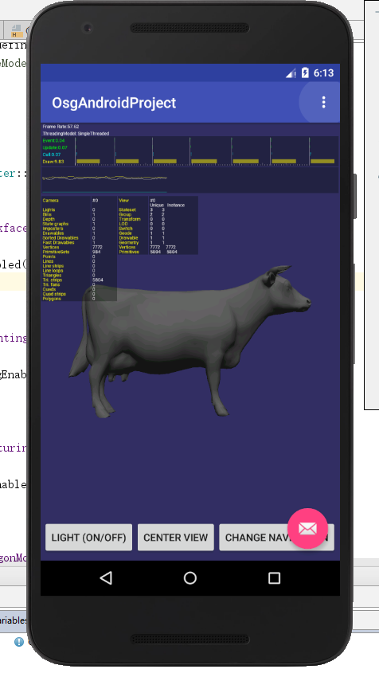

# 0. osg3.4.1 osgearth2.8 Android安å“移æ¤(预)

lawest äº 2018-06-12 16:24:21 å‘布 
åŸæ–‡é“¾æ¥ï¼šhttps://blog.csdn.net/lawest/article/details/80666958

本文介ç»äº†å¦‚何在Androidå¹³å°ä¸Šä½¿ç”¨Android Studioå’ŒCMake编译OSG核心模å—åŠå…¶ä¾èµ–库，包括JPEGã€PNGã€FreeTypeå’ŒTIFF等。文章还详细记录了针对Androidå¹³å°è¿›è¡Œå¿…è¦çš„代ç è°ƒæ•´ï¼Œä»¥è§£å†³åŠ¨æ€åº“加载和字体文件查找等问题。  


编译工具Android Studio ，使用cmake编译so动æ€åº“

osg核心模å—， jpeg , png , freetype ，tiff 等第三方库和部分æ’件编译已完æˆï¼Œ

之å‰é‡åˆ°å¾ˆå¤šå‘都没记录，ç°è®°å½•ä¸€ä¸‹ï¼Œå¦‚有时间将之å‰çš„补上：

## osg编译：
编译å‰å°†include下é¢osg下é¢çš„GL头文件更改如下如没有自己新建一个： 
```cpp
/* -*-c++-*- OpenSceneGraph - Copyright (C) 1998-2009 Robert Osfield
 *
 * This library is open source and may be redistributed and/or modified under
 * the terms of the OpenSceneGraph Public License (OSGPL) version 0.0 or
 * (at your option) any later version.  The full license is in LICENSE file
 * included with this distribution, and on the openscenegraph.org website.
 *
 * This library is distributed in the hope that it will be useful,
 * but WITHOUT ANY WARRANTY; without even the implied warranty of
 * MERCHANTABILITY or FITNESS FOR A PARTICULAR PURPOSE.  See the
 * OpenSceneGraph Public License for more details.
*/
 
#ifndef OSG_OPENGL
#define OSG_OPENGL 1
 
#include <osg/Config>
#include <osg/Export>
#include <osg/Types>
 
//#define OSG_GL1_AVAILABLE
//#define OSG_GL2_AVAILABLE
/* #undef OSG_GL3_AVAILABLE */
/* #undef OSG_GLES1_AVAILABLE */
/* #undef OSG_GLES2_AVAILABLE */
/* #undef OSG_GLES3_AVAILABLE */
/* #undef OSG_GL_LIBRARY_STATIC */
#define OSG_GLES2_AVAILABLE
//#define OSG_GL_LIBRARY_STATIC
//#define OSG_GL_DISPLAYLISTS_AVAILABLE
//#define OSG_GL_MATRICES_AVAILABLE
//#define OSG_GL_VERTEX_FUNCS_AVAILABLE
//#define OSG_GL_VERTEX_ARRAY_FUNCS_AVAILABLE
//#define OSG_GL_FIXED_FUNCTION_AVAILABLE
/* #undef GL_HEADER_HAS_GLINT64 */
/* #undef GL_HEADER_HAS_GLUINT64 */
 
#define OSG_GL1_FEATURES 0
#define OSG_GL2_FEATURES 0
#define OSG_GL3_FEATURES 0
#define OSG_GLES1_FEATURES 0
#define OSG_GLES2_FEATURES 1
#define OSG_GLES3_FEATURES 0
 
 
#ifndef WIN32
 
    // Required for compatibility with glext.h sytle function definitions of
    // OpenGL extensions, such as in src/osg/Point.cpp.
    #ifndef APIENTRY
        #define APIENTRY
    #endif
 
#else // WIN32
 
    #if defined(__CYGWIN__) || defined(__MINGW32__)
 
        #ifndef APIENTRY
                #define GLUT_APIENTRY_DEFINED
                #define APIENTRY __stdcall
        #endif
            // XXX This is from Win32's <windef.h>
        #ifndef CALLBACK
            #define CALLBACK __stdcall
        #endif
 
    #else // ! __CYGWIN__
 
        // Under Windows avoid including <windows.h>
        // to avoid name space pollution, but Win32's <GL/gl.h>
        // needs APIENTRY and WINGDIAPI defined properly.
        // XXX This is from Win32's <windef.h>
        #ifndef APIENTRY
            #define GLUT_APIENTRY_DEFINED
            #if (_MSC_VER >= 800) || defined(_STDCALL_SUPPORTED)
                #define WINAPI __stdcall
                #define APIENTRY WINAPI
            #else
                #define APIENTRY
            #endif
        #endif
 
            // XXX This is from Win32's <windef.h>
        #ifndef CALLBACK
            #if (_MSC_VER >= 800) || defined(_STDCALL_SUPPORTED)
                #define CALLBACK __stdcall
            #else
                #define CALLBACK
            #endif
        #endif
 
    #endif // __CYGWIN__
 
    // XXX This is from Win32's <wingdi.h> and <winnt.h>
    #ifndef WINGDIAPI
        #define GLUT_WINGDIAPI_DEFINED
        #define DECLSPEC_IMPORT __declspec(dllimport)
        #define WINGDIAPI DECLSPEC_IMPORT
    #endif
 
    // XXX This is from Win32's <ctype.h>
    #if !defined(_WCHAR_T_DEFINED) && !(defined(__GNUC__)&&(__GNUC__ > 2))
        typedef unsigned short wchar_t;
        #define _WCHAR_T_DEFINED
    #endif
 
#endif // WIN32
 
#if defined(OSG_GL3_AVAILABLE)
    #define GL3_PROTOTYPES 1
    #define GL_GLEXT_PROTOTYPES 1
#endif
 
 
#include <GLES2/gl2.h>
 
 
 
#ifndef GL_APIENTRY
    #define GL_APIENTRY APIENTRY
#endif // GL_APIENTRY
 
 
#ifndef GL_HEADER_HAS_GLINT64
    typedef int64_t GLint64;
#endif
 
#ifndef GL_HEADER_HAS_GLUINT64
    typedef uint64_t GLuint64;
#endif
 
#ifdef OSG_GL_MATRICES_AVAILABLE
 
    inline void glLoadMatrix(const float* mat) { glLoadMatrixf(static_cast<const GLfloat*>(mat)); }
    inline void glMultMatrix(const float* mat) { glMultMatrixf(static_cast<const GLfloat*>(mat)); }
 
    #ifdef OSG_GLES1_AVAILABLE
        inline void glLoadMatrix(const double* mat)
        {
            GLfloat flt_mat[16];
            for(unsigned int i=0;i<16;++i) flt_mat[i] = mat[i];
            glLoadMatrixf(flt_mat);
        }
 
        inline void glMultMatrix(const double* mat)
        {
            GLfloat flt_mat[16];
            for(unsigned int i=0;i<16;++i) flt_mat[i] = mat[i];
            glMultMatrixf(flt_mat);
        }
 
    #else
        inline void glLoadMatrix(const double* mat) { glLoadMatrixd(static_cast<const GLdouble*>(mat)); }
        inline void glMultMatrix(const double* mat) { glMultMatrixd(static_cast<const GLdouble*>(mat)); }
    #endif
#endif
 
// add defines for OpenGL targets that don't define them, just to ease compatibility across targets
#ifndef GL_DOUBLE
    #define GL_DOUBLE 0x140A
    typedef double GLdouble;
#endif
 
#ifndef GL_INT
    #define GL_INT 0x1404
#endif
 
#ifndef GL_UNSIGNED_INT
    #define GL_UNSIGNED_INT 0x1405
#endif
 
#ifndef GL_NONE
    // OpenGL ES1 doesn't provide GL_NONE
    #define GL_NONE 0x0
#endif
 
#if defined(OSG_GLES1_AVAILABLE) || defined(OSG_GLES2_AVAILABLE)
    //GLES defines (OES)
    #define GL_RGB8_OES                                             0x8051
    #define GL_RGBA8_OES                                            0x8058
#endif
 
#if defined(OSG_GLES1_AVAILABLE) || defined(OSG_GLES2_AVAILABLE) || defined(OSG_GL3_AVAILABLE)
    #define GL_POLYGON                         0x0009
    #define GL_QUADS                           0x0007
    #define GL_QUAD_STRIP                      0x0008
#endif
 
#if defined(OSG_GL3_AVAILABLE)
    #define GL_LUMINANCE                      0x1909
    #define GL_LUMINANCE_ALPHA                0x190A
#endif
 
 
#endif
```

osg核心模å—编译完æˆå有几处需è¦ä¿®æ”¹ï¼š

1.osg在加载动æ€åº“æ’件是是没有写Android对应分支的

    将osgDB下的Registry.cpp  createLibraryNameForExtension函数和createLibraryNameForNodeKit函数修改如下：
```cpp
std::string Registry::createLibraryNameForNodeKit(const std::string& name)
{
#if defined(__CYGWIN__)
    return "cyg"+name+OSG_LIBRARY_POSTFIX_WITH_QUOTES+".dll";
#elif defined(__MINGW32__)
    return "lib"+name+OSG_LIBRARY_POSTFIX_WITH_QUOTES+".dll";
#elif defined(WIN32)
    return name+OSG_LIBRARY_POSTFIX_WITH_QUOTES+".dll";
#elif macintosh
    return name+OSG_LIBRARY_POSTFIX_WITH_QUOTES;
#elif defined(__ANDROID_NDK__)
    return "lib"+name+OSG_LIBRARY_POSTFIX_WITH_QUOTES+".so";
#else
    return "lib"+name+OSG_LIBRARY_POSTFIX_WITH_QUOTES + ADDQUOTES(OSG_PLUGIN_EXTENSION);
#endif
}
```

```cpp
std::string Registry::createLibraryNameForExtension(const std::string& ext)
{
    std::string lowercase_ext;
    for(std::string::const_iterator sitr=ext.begin();
        sitr!=ext.end();
        ++sitr)
    {
        lowercase_ext.push_back(tolower(*sitr));
    }
 
    ExtensionAliasMap::iterator itr=_extAliasMap.find(lowercase_ext);
    if (itr!=_extAliasMap.end() && ext != itr->second) return createLibraryNameForExtension(itr->second);
 
    std::string prepend = std::string("osgPlugins-")+std::string(osgGetVersion())+std::string("/");
 
#if defined(__CYGWIN__)
    return prepend+"cygwin_"+"osgdb_"+lowercase_ext+OSG_LIBRARY_POSTFIX_WITH_QUOTES+".dll";
#elif defined(__MINGW32__)
    return prepend+"mingw_"+"osgdb_"+lowercase_ext+OSG_LIBRARY_POSTFIX_WITH_QUOTES+".dll";
#elif defined(WIN32)
    return prepend+"osgdb_"+lowercase_ext+OSG_LIBRARY_POSTFIX_WITH_QUOTES+".dll";
#elif macintosh
    return prepend+"osgdb_"+lowercase_ext+OSG_LIBRARY_POSTFIX_WITH_QUOTES;
#elif defined(__ANDROID_NDK__)
    return std::string("lib")+"osgdb_"+lowercase_ext+OSG_LIBRARY_POSTFIX_WITH_QUOTES+".so";
#else
    return prepend+"osgdb_"+lowercase_ext+OSG_LIBRARY_POSTFIX_WITH_QUOTES+ADDQUOTES(OSG_PLUGIN_EXTENSION);
#endif
 
}
```

将osgDB下DynamicLibrary.cpp的getLibraryHandle函数修改如下：
```cpp
DynamicLibrary::HANDLE DynamicLibrary::getLibraryHandle( const std::string& libraryName)
{
    HANDLE handle = NULL;
 
#if defined(WIN32) && !defined(__CYGWIN__)
#ifdef OSG_USE_UTF8_FILENAME
    handle = LoadLibraryW(  convertUTF8toUTF16(libraryName).c_str() );
#else
    handle = LoadLibrary( libraryName.c_str() );
#endif
#elif defined(__APPLE__) && defined(APPLE_PRE_10_3)
    NSObjectFileImage image;
    // NSModule os_handle = NULL;
    if (NSCreateObjectFileImageFromFile(libraryName.c_str(), &image) == NSObjectFileImageSuccess) {
        // os_handle = NSLinkModule(image, libraryName.c_str(), TRUE);
        handle = NSLinkModule(image, libraryName.c_str(), TRUE);
        NSDestroyObjectFileImage(image);
    }
#elif defined(__hpux)
    // BIND_FIRST is necessary for some reason
    handle = shl_load ( libraryName.c_str(), BIND_DEFERRED|BIND_FIRST|BIND_VERBOSE, 0);
    return handle;
#else // other unix
 
    // dlopen will not work with files in the current directory unless
    // they are prefaced with './'  (DB - Nov 5, 2003).
    std::string localLibraryName;
    if( libraryName == osgDB::getSimpleFileName( libraryName ) )
        localLibraryName = "./" + libraryName;
    else
        localLibraryName = libraryName;
 
#ifdef __ANDROID_NDK__
    localLibraryName = libraryName;
#endif
 
    handle = dlopen( localLibraryName.c_str(), RTLD_LAZY | RTLD_GLOBAL);
    if( handle == NULL )
    {
        if (fileExists(localLibraryName))
        {
            OSG_WARN << "Warning: dynamic library '" << libraryName << "' exists, but an error occurred while trying to open it:" << std::endl;
            OSG_WARN << dlerror() << std::endl;
        }
        else
        {
            OSG_INFO << "Warning: dynamic library '" << libraryName << "' does not exist (or isn't readable):" << std::endl;
            OSG_INFO << dlerror() << std::endl;
        }
    }
#endif
    return handle;
}
```

2.ç”±äºosg默认加载的字体是arial.ttf,安å“系统没有这个字体，而且就算有这个字体他的拼写方å¼ä¹Ÿä¸å¯¹ï¼Œç°å°†osgText模å—下的Font.cppçš„findFontFile函数修改如下:
```cpp
std::string osgText::findFontFile(const std::string& str)
{
    // try looking in OSGFILEPATH etc first for fonts.
    std::string filename = osgDB::findDataFile(str);
    if (!filename.empty()) return filename;
 
    OpenThreads::ScopedLock<OpenThreads::ReentrantMutex> lock(getFontFileMutex());
 
#ifdef __ANDROID_NDK__
    std::string* pStr = const_cast<std::string*>(&str);
    *pStr = "Roboto-Regular.ttf";
#endif
 
    static osgDB::FilePathList s_FontFilePath;
    static bool initialized = false;
    if (!initialized)
    {
        initialized = true;
    #if defined(WIN32)
        osgDB::convertStringPathIntoFilePathList(
            ".;C:/winnt/fonts;C:/windows/fonts",
            s_FontFilePath);
 
        char *ptr;
        if ((ptr = getenv( "windir" )))
        {
            std::string winFontPath = ptr;
            winFontPath += "\\fonts";
            s_FontFilePath.push_back(winFontPath);
        }
    #elif defined(__ANDROID_NDK__)
        std::string strSysFont = "/system/fonts/";
        s_FontFilePath.push_back(strSysFont);
    #elif defined(__APPLE__)
      osgDB::convertStringPathIntoFilePathList(
        ".:/usr/share/fonts/ttf:/usr/share/fonts/ttf/western:/usr/share/fonts/ttf/decoratives:/Library/Fonts:/System/Library/Fonts",
        s_FontFilePath);
    #else
      osgDB::convertStringPathIntoFilePathList(
        ".:/usr/share/fonts/ttf:/usr/share/fonts/ttf/western:/usr/share/fonts/ttf/decoratives",
        s_FontFilePath);
    #endif
    }
 
 
 
    filename = osgDB::findFileInPath(str,s_FontFilePath);
    if (!filename.empty()) return filename;
 
    // Try filename without pathname, if it has a path
    filename = osgDB::getSimpleFileName(str);
    if(filename!=str)
    {
        filename = osgDB::findFileInPath(filename,s_FontFilePath);
        if (!filename.empty()) return filename;
    }
    else
    {
        filename = osgText::findFontFile(std::string("fonts/")+filename);
        if (!filename.empty()) return filename;
    }
 
    // Not found, return empty string
    OSG_INFO<<"Warning: font file \""<<str<<"\" not found."<<std::endl;
    return std::string();
}
```
虽然这样ä¸æ€ä¹ˆå¥½ä½†æ˜¯è¿˜æ˜¯å…ˆè¿™æ ·ã€‚

编译å测试：

贴张纹ç†ï¼ˆéœ€è¦ä¿®æ”¹è‡ªå¸¦ä¾‹å­å’ŒShader，有时间å›å¸–上）
 

 牛，纹ç†æ²¡è´´ä¸Šå»ï¼Œå¯èƒ½å’Œæ•°æ®æ ¼å¼æœ‰å…³åé¢å† æ’查：


在Android上æ“作器有点问题，鼠标çµæ•åº¦å¤ªå¤§ï¼Œè®¾ç½®ä¸€ä¸ªå› å­å°±å¥½ï¼Œä½†æ˜¯è¿˜æ˜¯æœ‰é—®é¢˜ï¼Œåœ¨XZ轴上旋转正常，但是很Y轴很难旋转，åé¢ç»§ç»­ä¿®æ”¹æ“作。

====================================================
# 1.jpeg-libpng-freetype
### 1.jpeg 库的 github地å€

jpeg 库（通常指 libjpeg，最ç»å…¸çš„ JPEG 图åƒç¼–解ç åº“）的官方代ç ä»“库托管在 SourceForge，ä¸è¿‡åœ¨ GitHub 上有其镜åƒä»“库åŠè¡ç”Ÿç‰ˆæœ¬ã€‚以下是几个常用的相关 GitHub 地å€ï¼š

> 1. **libjpeg-turbo（高性能è¡ç”Ÿç‰ˆï¼Œæœ€å¸¸ç”¨ï¼‰**  
>    这是 libjpeg 的优化版本，æ供更快的编解ç é€Ÿåº¦ï¼Œå¹¿æ³›ç”¨äºå„类项目中。  
>    GitHub 地å€ï¼šhttps://github.com/libjpeg-turbo/libjpeg-turbo
> 
> 2. **ijg/libjpeg（官方åŸç‰ˆé•œåƒï¼‰**  
>    这是 Independent JPEG Group（IJG）维护的官方 libjpeg é•œåƒï¼Œä¿æŒä¸å®˜æ–¹æºç åŒæ­¥ã€‚  
>    地å€ï¼šhttp://www.ijg.org/files/jpegsrc.v9f.tar.gz
> 
> 3. **mozjpeg（Mozilla 优化版）**  
>    ç”± Mozilla å¼€å‘çš„ libjpeg è¡ç”Ÿç‰ˆï¼Œé’ˆå¯¹ Web 场景优化，生æˆçš„ JPEG 文件体积更å°ã€‚  
>    GitHub 地å€ï¼šhttps://github.com/mozilla/mozjpeg

其中，**libjpeg-turbo** 因其高性能和广泛兼容性，是目å‰æœ€æ¨è使用的版本。

```sh
# ----my cmd
cmake -S. -Bbuild/jpeg-ubuntu-dbg -DCMAKE_BUILD_TYPE=Debug
cmake --build  build/jpeg-ubuntu-dbg 

cmake --build  build/jpeg-ubuntu-dbg    --target install  -j8
```

===== 
### 2. libpngçš„github 地å€

libpng æ˜¯å¤„ç† PNG 图åƒæ ¼å¼çš„主æµåº“，其官方维护的 GitHub 仓库地å€å¦‚下：
https://github.com/glennrp/libpng

这是由 libpng 主è¦ç»´æŠ¤è€… Glenn Randers-Pehrson 管ç†çš„官方仓库，包å«äº†æœ€æ–°çš„æºä»£ç ã€å‘布版本以åŠå¼€å‘文档。该仓库æŒç»­æ›´æ–°ï¼Œç”¨äºç»´æŠ¤å’Œå‘展 libpng 库的功能，是è·å– libpng æºç çš„æƒå¨æ¥æºã€‚

```sh
# é…ç½®CMake  
cmake .. -G "$Generator" -A x64 `
-DCMAKE_BUILD_TYPE=RelWithDebInfo `
-DCMAKE_PREFIX_PATH="$InstallDir" `
-DCMAKE_INSTALL_PREFIX="$InstallDir" `
-DPNG_TESTS=OFF `
-DPNG_STATIC=OFF `

# æ„建阶段，指定æ„建类å‹
cmake --build . --config RelWithDebInfo

# 安装阶段，指定æ„建类å‹å’Œå®‰è£…目标
cmake --build . --config RelWithDebInfo --target install
```

```sh
# ----my cmd
# é…ç½®CMake
buildDir=build/png-ubuntu-static
cmake -S. -B${buildDir} -DCMAKE_BUILD_TYPE=Debug  

cmake --build  ${buildDir} --config Debug --target install
```
 
### 3.freetype库的github 地å€

freetype 库是一个广泛使用的字体渲染引æ“，其官方 GitHub 仓库地å€å¦‚下：
https://github.com/freetype/freetype

这是由 FreeType 项目官方维护的仓库，包å«äº†è¯¥åº“的完整æºä»£ç ã€å¼€å‘文档以åŠç‰ˆæœ¬å‘布信æ¯ã€‚FreeType 库支æŒå¤šç§å­—体格å¼ï¼Œå¦‚ TrueTypeã€OpenTypeã€Type1 等，被广泛应用äºå›¾å½¢ç•Œé¢ã€æ’版系统等领域。


#### CMakeæ„建学习笔记7-freetype库的æ„建
å‘å¸ƒäº 2024-12-14 09:07:37
Freetype是一个广泛使用的开æºå­—体渲染库，å¯ä»¥åŠ è½½ã€æ¸²æŸ“和显示å„ç§ç±»å‹çš„字体文件。一般的用户æ¥è¯´å¯èƒ½æ²¡æœ‰ç›´æ¥ä½¿ç”¨è¿‡è¿™ä¸ªåº“，都是通过使用ä¾èµ–äºå®ƒçš„ä¾èµ–库æ¥é—´æ¥ä½¿ç”¨å®ƒã€‚æ ¹æ®ç¬”者æ„建的ç»éªŒï¼Œæ„建这个库需è¦zlibã€libpng这两个库，å¯ä»¥æŒ‰ç…§æœ¬ç³»åˆ—åšæ–‡çš„相应文章æå‰æ„建好。关键的æ„建指令如下所示：
```sh
# é…ç½®CMake      
cmake .. -G "$Generator" -A x64 `
    -DBUILD_SHARED_LIBS=true `
    -DCMAKE_BUILD_TYPE=RelWithDebInfo `
    -DCMAKE_PREFIX_PATH="$InstallDir" `
    -DCMAKE_INSTALL_PREFIX="$InstallDir"        

# æ„建阶段，指定æ„建类å‹
cmake --build . --config RelWithDebInfo

# 安装阶段，指定æ„建类å‹å’Œå®‰è£…目标
cmake --build . --config RelWithDebInfo --target install
```

```sh
# ----my cmd
cmake -S. -Bbuild/freetype-ubuntu-dbg -DCMAKE_BUILD_TYPE=Debug
cmake --build  build/freetype-ubuntu-dbg 

cmake --build  build/freetype-ubuntu-dbg    --target install  -j8
```
=====================================
# 2.tiffçš„github地å€

å¤„ç† TIFF 图åƒæ ¼å¼çš„主æµåº“是 libtiff，其官方维护的 GitHub 仓库地å€å¦‚下：

<!-- https://github.com/libtiff/libtiff  -->
https://github.com/vadz/libtiff.git
这个仓库由 libtiff 项目团队维护，包å«äº†åº“的完整æºä»£ç ã€æµ‹è¯•ç”¨ä¾‹å’Œæ–‡æ¡£ã€‚libtiff 支æŒå¤šç§ TIFF æ ¼å¼çš„读写æ“作，是图åƒå¤„ç†é¢†åŸŸå¤„ç† TIFF 文件的常用工具库。

```sh
# ----my cmd
cmake -S. -Bbuild01/tiff-ubuntu-dbg -DCMAKE_BUILD_TYPE=Debug
cmake --build  build01/tiff-ubuntu-dbg 

cmake --build  build01/tiff-ubuntu-dbg   --  -j8  install
```

# 6. libjpeg-turbo cannot be integrated using add_subdirectory()

## 问题
```sh
CMake Error at 3rd/libjpeg-turbo/CMakeLists.txt:70 (message):
  The libjpeg-turbo build system cannot be integrated into another build
  system using add_subdirectory().  Use ExternalProject_Add() instead.
```

## 腾讯元å®
è¿™ä¸ªé”™è¯¯è¡¨æ˜ **libjpeg-turbo** çš„æ„建系统设计上ä¸æ”¯æŒé€šè¿‡ `add_subdirectory()` ç›´æ¥é›†æˆåˆ°ä½ çš„ CMake 项目中，必须改用 `ExternalProject_Add()` 或 `FetchContent` æ¥ç‹¬ç«‹æ„建它。以下是解决方案：

---

### **åŸå› åˆ†æ**
libjpeg-turbo çš„ `CMakeLists.txt` æ˜ç¡®ç¦æ­¢äº† `add_subdirectory()` 的集æˆæ–¹å¼ï¼ˆhttps://github.com/libjpeg-turbo/libjpeg-turbo/blob/main/CMakeLists.txt#L70），因为：
1. 它需è¦ç‹¬ç«‹çš„æ„建ç¯å¢ƒï¼ˆå¦‚ NASM 汇编器）。
2. 它的 CMake é…ç½®å¯èƒ½ä¸å…¶ä»–项目冲çªï¼ˆå¦‚å˜é‡å污染）。
3. 官方æ¨è通过系统包或 `ExternalProject` æ–¹å¼ä½¿ç”¨ã€‚

---

### **解决方案**
#### **方法 1：使用 `ExternalProject_Add()`（æ¨è）**
在项目的 `CMakeLists.txt` 中添加：
```cmake
include(ExternalProject)

ExternalProject_Add(
    libjpeg-turbo
    GIT_REPOSITORY "https://github.com/libjpeg-turbo/libjpeg-turbo.git"
    GIT_TAG "2.1.5"  # 指定版本
    CMAKE_ARGS
        -DCMAKE_INSTALL_PREFIX=<INSTALL_DIR>  # 指定安装路径
        -DWITH_JPEG8=ON  # å¯ç”¨JPEG 8兼容性
        -DCMAKE_BUILD_TYPE=Release
    BUILD_ALWAYS OFF
)

# å°† libjpeg-turbo 的头文件和库路径链æ¥åˆ°ä½ çš„项目
target_include_directories(your_target PRIVATE
    ${CMAKE_INSTALL_PREFIX}/include
)
target_link_directories(your_target PRIVATE
    ${CMAKE_INSTALL_PREFIX}/lib
)
target_link_libraries(your_target PRIVATE
    jpeg-static  # 或 jpeg
)
```

#### **方法 2：使用 `FetchContent`（CMake 3.11+）**
```cmake
include(FetchContent)

FetchContent_Declare(
    libjpeg-turbo
    GIT_REPOSITORY "https://github.com/libjpeg-turbo/libjpeg-turbo.git"
    GIT_TAG "2.1.5"
)

# 手动指定æ„建和安装路径
set(LIBJPEG_TURBO_BUILD_DIR ${CMAKE_BINARY_DIR}/libjpeg-turbo-build)
set(LIBJPEG_TURBO_INSTALL_DIR ${CMAKE_BINARY_DIR}/libjpeg-turbo-install)

# é…置独立æ„建
FetchContent_GetProperties(libjpeg-turbo)
if(NOT libjpeg-turbo_POPULATED)
    FetchContent_Populate(libjpeg-turbo)
    execute_process(
        COMMAND ${CMAKE_COMMAND} -S ${libjpeg-turbo_SOURCE_DIR} -B ${LIBJPEG_TURBO_BUILD_DIR}
                -DCMAKE_INSTALL_PREFIX=${LIBJPEG_TURBO_INSTALL_DIR}
                -DWITH_JPEG8=ON
        WORKING_DIRECTORY ${CMAKE_BINARY_DIR}
    )
    execute_process(
        COMMAND ${CMAKE_COMMAND} --build ${LIBJPEG_TURBO_BUILD_DIR} --target install
    )
endif()

# 链æ¥åˆ°ä½ çš„项目
target_include_directories(your_target PRIVATE
    ${LIBJPEG_TURBO_INSTALL_DIR}/include
)
target_link_libraries(your_target PRIVATE
    ${LIBJPEG_TURBO_INSTALL_DIR}/lib/libjpeg.a
)
```

#### **方法 3：通过系统包管ç†å™¨å®‰è£…**
```bash
# Ubuntu/Debian
sudo apt install libjpeg-turbo8-dev

# CentOS/RHEL
sudo yum install libjpeg-turbo-devel
```
然å在 CMake 中直æ¥æŸ¥æ‰¾ï¼š
```cmake
find_package(JPEG REQUIRED)
target_link_libraries(your_target PRIVATE JPEG::JPEG)
```

---

### **关键注æ„事项**
1. **é™æ€åº“ vs 动æ€åº“**  
   libjpeg-turbo 默认生æˆé™æ€åº“（`libjpeg.a`），如需动æ€åº“，添加：
   ```cmake
   -DENABLE_SHARED=ON
   ```

2. **NASM ä¾èµ–**  
   如æœå¯ç”¨ SIMD 优化（默认开å¯ï¼‰ï¼Œéœ€æå‰å®‰è£… NASM：
   ```bash
   sudo apt install nasm
   ```

3. **安装路径冲çª**  
   ç¡®ä¿ `CMAKE_INSTALL_PREFIX` ä¸ä¸ç³»ç»Ÿè·¯å¾„冲çªï¼Œå»ºè®®ç”¨æœ¬åœ°è·¯å¾„（如 `${PROJECT_BINARY_DIR}/deps`）。

4. **交å‰ç¼–译**  
   若需交å‰ç¼–译，传递 `-DCMAKE_TOOLCHAIN_FILE` ç»™ `ExternalProject_Add`。

---

### **错误处ç†**
- **找ä¸åˆ° NASM**：安装 NASM 或ç¦ç”¨ SIMD：
  ```cmake
  -DWITH_SIMD=OFF
  ```
- **æƒé™é—®é¢˜**ï¼šç¡®ä¿ `INSTALL_DIR` å¯å†™ã€‚
- **版本冲çª**：指定æ˜ç¡®çš„ `GIT_TAG` 或下载æºç å‹ç¼©åŒ…。

---

### **总结**
| 方法                | 适用场景                          | 优点                     |
|---------------------|----------------------------------|--------------------------|
| `ExternalProject`   | 需æ§åˆ¶æ„建细节（如交å‰ç¼–译）       | çµæ´»ï¼Œéš”离性强           |
| `FetchContent`      | CMake 3.11+，希望自动化ä¾èµ–ç®¡ç†    | 无需预安装，集æˆç®€ä¾¿      |
| 系统包              | 快速集æˆï¼Œä¸éœ€å®šåˆ¶æ„建            | 最简å•ï¼Œä½†ç‰ˆæœ¬å¯èƒ½è¾ƒæ—§   |

æ¨è优先使用 `ExternalProject_Add()`，尤其对稳定性è¦æ±‚高的项目。

====================================================
# 7. libjpeg-turbo代ç å·²ç»æ‰‹åŠ¨ä¸‹è½½åˆ° 3rd/libjpeg-turbo/如何设置ExternalProject_Add

如æœä½ çš„ **libjpeg-turbo** æºç å·²ç»æ‰‹åŠ¨ä¸‹è½½åˆ° `3rd/libjpeg-turbo/`，但ä»ç„¶å¸Œæœ›ä½¿ç”¨ `ExternalProject_Add()` 进行独立æ„建（é¿å… `add_subdirectory()` 的问题），å¯ä»¥æŒ‰ä»¥ä¸‹æ–¹å¼é…置：

---

### **解决方案：使用 `ExternalProject_Add` æ„建本地æºç **
在项目的 `CMakeLists.txt` 中添加以下内容：

```cmake
include(ExternalProject)

# 设置 libjpeg-turbo çš„æºç è·¯å¾„（å‡è®¾æ”¾åœ¨ 3rd/libjpeg-turbo/）
set(LIBJPEG_TURBO_SOURCE_DIR ${CMAKE_SOURCE_DIR}/3rd/libjpeg-turbo)
set(LIBJPEG_TURBO_BUILD_DIR ${CMAKE_BINARY_DIR}/libjpeg-turbo-build)
set(LIBJPEG_TURBO_INSTALL_DIR ${CMAKE_BINARY_DIR}/libjpeg-turbo-install)

# 添加 ExternalProject æ„建
ExternalProject_Add(
    libjpeg-turbo
    SOURCE_DIR ${LIBJPEG_TURBO_SOURCE_DIR}  # 指定本地æºç è·¯å¾„
    BINARY_DIR ${LIBJPEG_TURBO_BUILD_DIR}    # æ„建目录（建议放在 build 目录下）
    INSTALL_DIR ${LIBJPEG_TURBO_INSTALL_DIR} # 安装目录
    CMAKE_ARGS
        -DCMAKE_INSTALL_PREFIX=${LIBJPEG_TURBO_INSTALL_DIR}  # 必须指定安装路径
        -DWITH_JPEG8=ON      # å¯ç”¨ JPEG 8 兼容性
        -DENABLE_SHARED=OFF  # 默认æ„建é™æ€åº“（如需动æ€åº“改为 ON）
        -DWITH_SIMD=ON       # å¯ç”¨ SIMD 优化（需安装 NASM）
    BUILD_ALWAYS OFF         # 仅在æºç å˜æ›´æ—¶é‡æ–°æ„建
)

# å°† libjpeg-turbo 的头文件和库路径链æ¥åˆ°ä½ çš„目标
add_library(libjpeg-turbo-imported STATIC IMPORTED)
add_dependencies(libjpeg-turbo-imported libjpeg-turbo)  # ä¾èµ– ExternalProject

# 设置导入库的路径
set_target_properties(libjpeg-turbo-imported PROPERTIES
    IMPORTED_LOCATION ${LIBJPEG_TURBO_INSTALL_DIR}/lib/${CMAKE_STATIC_LIBRARY_PREFIX}jpeg${CMAKE_STATIC_LIBRARY_SUFFIX}
    INTERFACE_INCLUDE_DIRECTORIES ${LIBJPEG_TURBO_INSTALL_DIR}/include
)

# åœ¨ä½ çš„ç›®æ ‡ä¸­é“¾æ¥ libjpeg-turbo
target_link_libraries(your_target PRIVATE libjpeg-turbo-imported)
```

---

### **关键说æ˜**
1. **æºç è·¯å¾„**  
   - `SOURCE_DIR` ç›´æ¥æŒ‡å‘你本地的 `3rd/libjpeg-turbo/`，é¿å…é‡å¤ä¸‹è½½ã€‚

2. **独立æ„建**  
   - `BINARY_DIR` å’Œ `INSTALL_DIR` 设置为 `${CMAKE_BINARY_DIR}` 下的å­ç›®å½•ï¼Œç¡®ä¿ä¸ä¸»é¡¹ç›®éš”离。

3. **安装路径**  
   - `CMAKE_INSTALL_PREFIX` 必须指定，å¦åˆ™ libjpeg-turbo ä¸ä¼šå®‰è£…到指定ä½ç½®ã€‚

4. **SIMD 优化**  
   - 如æœå¯ç”¨ `-DWITH_SIMD=ON`（默认），需æå‰å®‰è£… NASM：
     ```bash
     sudo apt install nasm  # Ubuntu/Debian
     ```

5. **é™æ€åº“ vs 动æ€åº“**  
   - 默认生æˆé™æ€åº“（`libjpeg.a`），如需动æ€åº“改为 `-DENABLE_SHARED=ON`。

---

### **常è§é—®é¢˜å¤„ç†**
#### **1. æ„建失败：找ä¸åˆ° NASM**
```text
CMake Error: NASM not found
```
- **解决**：安装 NASM 或ç¦ç”¨ SIMD：
  ```cmake
  -DWITH_SIMD=OFF
  ```

#### **2. 链æ¥é”™è¯¯ï¼šæ‰¾ä¸åˆ° `jpeg` 库**
- **检查**ï¼šç¡®ä¿ `IMPORTED_LOCATION` 路径正确，例如：
  ```cmake
  message(STATUS "Libjpeg path: ${LIBJPEG_TURBO_INSTALL_DIR}/lib/${CMAKE_STATIC_LIBRARY_PREFIX}jpeg${CMAKE_STATIC_LIBRARY_SUFFIX}")
  ```

#### **3. 如何清ç†æ„建缓存？**
- 删除 `libjpeg-turbo-build` å’Œ `libjpeg-turbo-install` 目录åé‡æ–°æ„建。

---

### **替代方案：直æ¥è°ƒç”¨ CMake æ„建**
如æœä¸æƒ³ç”¨ `ExternalProject_Add`，å¯ä»¥æ‰‹åŠ¨æ„建：
```bash
cd 3rd/libjpeg-turbo
mkdir build && cd build
cmake -DCMAKE_INSTALL_PREFIX=../../install -DWITH_JPEG8=ON ..
make -j8 && make install
```
然å在主项目中引用：
```cmake
target_include_directories(your_target PRIVATE ${CMAKE_SOURCE_DIR}/install/include)
target_link_directories(your_target PRIVATE ${CMAKE_SOURCE_DIR}/install/lib)
target_link_libraries(your_target PRIVATE jpeg)
```

---

### **总结**
| 方法               | 优点                          | 缺点                     |
|--------------------|-------------------------------|--------------------------|
| `ExternalProject`  | 自动化æ„建，隔离ä¾èµ–           | é…ç½®ç¨å¤æ‚               |
| 手动æ„建           | ç›´æ¥æ§åˆ¶ï¼Œè°ƒè¯•æ–¹ä¾¿            | 需手动维护安装路径       |

æ¨è使用 `ExternalProject_Add`，尤其适åˆéœ€è¦è·¨å¹³å°æˆ– CI/CD 集æˆçš„项目。

============================================
# 8. libpslæºç å·²ç»ä½äº3rd66/libpsl ，如何 3rd66/CMakeLists.txt中写ExternalProject_Add编译libpsl

如æœä½ çš„ `libpsl` æºç å·²ç»ä½äº `3rd66/libpsl`（而ä¸æ˜¯ä» Git 下载），那么 `ExternalProject_Add` 的写法会更简å•ï¼Œå› ä¸ºä½ ä¸éœ€è¦ `GIT_REPOSITORY`，而是直æ¥ä½¿ç”¨ `SOURCE_DIR` 指定æºç è·¯å¾„。  

---

### **方法 1：使用 autotools æ„建（æ¨è）**
```cmake
include(ExternalProject)

ExternalProject_Add(
    libpsl
    SOURCE_DIR ${CMAKE_CURRENT_SOURCE_DIR}/libpsl  # æºç è·¯å¾„
    PREFIX ${CMAKE_BINARY_DIR}/3rd66/libpsl-build  # æ„建临时目录
    CONFIGURE_COMMAND <SOURCE_DIR>/autogen.sh && <SOURCE_DIR>/configure --prefix=${CMAKE_INSTALL_PREFIX} --disable-shared --enable-static
    BUILD_COMMAND make
    INSTALL_COMMAND make install
    BUILD_IN_SOURCE 0  # 使用独立æ„建目录（é¿å…污染æºç ï¼‰
    BUILD_BYPRODUCTS ${CMAKE_INSTALL_PREFIX}/lib/libpsl.a  # ç¡®ä¿ CMake 能检测到生æˆçš„库
)
```

#### **关键点**：
1. **`SOURCE_DIR`**：直æ¥æŒ‡å‘ `3rd66/libpsl` æºç ç›®å½•ã€‚
2. **`PREFIX`**：æ„建临时目录（建议放在 `CMAKE_BINARY_DIR` 下）。
3. **`CONFIGURE_COMMAND`**：
   - `<SOURCE_DIR>/autogen.sh` ç”Ÿæˆ `configure`（如æœä» Git 克隆的æºç å¯èƒ½éœ€è¦ï¼‰ã€‚
   - `<SOURCE_DIR>/configure --prefix=...` 指定安装路径。
   - `--disable-shared --enable-static` å¯é€‰ï¼Œå¦‚æœä½ åªéœ€è¦é™æ€åº“。
4. **`BUILD_IN_SOURCE 0`**：使用独立æ„建目录（é¿å…污染æºç ï¼‰ã€‚
5. **`BUILD_BYPRODUCTS`**：让 CMake 知é“生æˆçš„库文件路径。

---

### **方法 2：使用 meson æ„建**
如æœä½ çš„ç³»ç»Ÿæ”¯æŒ `meson`，也å¯ä»¥è¿™æ ·å†™ï¼š
```cmake
find_program(MESON meson REQUIRED)
find_program(NINJA ninja REQUIRED)

ExternalProject_Add(
    libpsl
    SOURCE_DIR ${CMAKE_CURRENT_SOURCE_DIR}/libpsl
    PREFIX ${CMAKE_BINARY_DIR}/3rd66/libpsl-build
    CONFIGURE_COMMAND ${MESON} setup <BINARY_DIR> <SOURCE_DIR> --prefix=${CMAKE_INSTALL_PREFIX} --default-library=static
    BUILD_COMMAND ${NINJA} -C <BINARY_DIR>
    INSTALL_COMMAND ${NINJA} -C <BINARY_DIR> install
    BUILD_BYPRODUCTS ${CMAKE_INSTALL_PREFIX}/lib/libpsl.a
)
```

---

### **在 CMake 中使用编译好的 libpsl**
编译完æˆå，你å¯ä»¥è¿™æ ·é“¾æ¥ï¼š
```cmake
# æ–¹å¼ 1：直æ¥å¼•ç”¨åº“文件
find_library(LIBPSL_LIB libpsl HINTS ${CMAKE_INSTALL_PREFIX}/lib)
find_path(LIBPSL_INCLUDE_DIR psl.h HINTS ${CMAKE_INSTALL_PREFIX}/include)

# æ–¹å¼ 2：创建导入目标（æ¨è）
add_library(libpsl::libpsl STATIC IMPORTED)
set_target_properties(libpsl::libpsl PROPERTIES
    IMPORTED_LOCATION ${LIBPSL_LIB}
    INTERFACE_INCLUDE_DIRECTORIES ${LIBPSL_INCLUDE_DIR}
)

# 在你的目标中使用
target_link_libraries(your_target PRIVATE libpsl::libpsl)
```

---

### **å¯èƒ½é‡åˆ°çš„问题 & 解决方案**
1. **`autogen.sh` 报错**：
   - ç¡®ä¿å®‰è£…了 `autoconf`, `automake`, `libtool`：
     ```sh
     sudo apt-get install autoconf automake libtool
     ```
   - å¦‚æœ `autogen.sh` ä¸å­˜åœ¨ï¼Œå¯èƒ½æ˜¯æºç åŒ…å·²ç»åŒ…å« `configure`，å¯ä»¥è·³è¿‡ï¼š
     ```cmake
     CONFIGURE_COMMAND <SOURCE_DIR>/configure --prefix=${CMAKE_INSTALL_PREFIX}
     ```

2. **ä¾èµ– `libicu` 或 `libidn2`**：
   - ç¡®ä¿ç³»ç»Ÿå·²å®‰è£…：
     ```sh
     sudo apt-get install libicu-dev libidn2-dev
     ```

3. **Windows 支æŒ**：
   - 如æœè¦åœ¨ Windows 上æ„建，建议使用 `msvc/README.MSVC.md` 中的方法，或者改用 `vcpkg`。

---

### **完整示例（æ¨è）**
```cmake
include(ExternalProject)

# æ„建 libpsl
ExternalProject_Add(
    libpsl
    SOURCE_DIR ${CMAKE_CURRENT_SOURCE_DIR}/libpsl
    PREFIX ${CMAKE_BINARY_DIR}/3rd66/libpsl-build
    CONFIGURE_COMMAND <SOURCE_DIR>/configure --prefix=${CMAKE_INSTALL_PREFIX} --disable-shared --enable-static
    BUILD_COMMAND make
    INSTALL_COMMAND make install
    BUILD_BYPRODUCTS ${CMAKE_INSTALL_PREFIX}/lib/libpsl.a
)

# 在你的目标中使用
add_executable(your_target main.c)
target_link_libraries(your_target PRIVATE ${CMAKE_INSTALL_PREFIX}/lib/libpsl.a)
target_include_directories(your_target PRIVATE ${CMAKE_INSTALL_PREFIX}/include)
```

这样，`libpsl` 就会在 CMake æ„建时自动编译并安装到 `${CMAKE_INSTALL_PREFIX}`，然å你的项目å¯ä»¥æ­£ç¡®é“¾æ¥å®ƒã€‚


===============================================
# 9.gdalæºç ä¾èµ–的第3方库

https://github.com/OSGeo/gdal.git
GDAL（Geospatial Data Abstraction Library）在编译时ä¾èµ–多个第三方库以å®ç°å¯¹ä¸åŒåœ°ç†æ•°æ®æ ¼å¼å’ŒåŠŸèƒ½çš„支æŒã€‚以下是 **GDAL 核心ä¾èµ–的第三方库**åŠå…¶ä½œç”¨ï¼Œåˆ†ä¸º **必需ä¾èµ–** å’Œ **å¯é€‰ä¾èµ–**：

---

### **1. 必需ä¾èµ–（编译时必须）**
| **库å**       | **作用**                          | **Ubuntu/Debian 安装命令**              |
|----------------|----------------------------------|---------------------------------------|
| **libgeos**    | 几何è¿ç®—引æ“（空间分æã€æ‹“扑æ“作）     | `sudo apt install libgeos-dev`       |
| **libproj**    | å标投影转æ¢ï¼ˆPROJ 库）             | `sudo apt install libproj-dev`       |
| **libsqlite3** | SQLite æ•°æ®åº“é©±åŠ¨ï¼ˆæ”¯æŒ GeoPackage） | `sudo apt install libsqlite3-dev`    |
| **libexpat**   | XML 解æ（如 GMLã€KML æ ¼å¼ï¼‰        | `sudo apt install libexpat-dev`      |
| **libcurl**    | 网络数æ®ä¼ è¾“（HTTP/FTP 访问）       | `sudo apt install libcurl4-openssl-dev` |

---

### **2. å¯é€‰ä¾èµ–（按需å¯ç”¨ï¼‰**
#### **2.1 栅格数æ®æ ¼å¼æ”¯æŒ**
| **库å**            | **支æŒæ ¼å¼**                  | **安装命令**                          |
|---------------------|-----------------------------|--------------------------------------|
| **libtiff**         | TIFF/GeoTIFF                | `sudo apt install libtiff-dev`       |
| **libpng**          | PNG                         | `sudo apt install libpng-dev`        |
| **libjpeg**         | JPEG                        | `sudo apt install libjpeg-dev`       |
| **libgif**          | GIF                         | `sudo apt install libgif-dev`        |
| **libhdf5**         | HDF5                        | `sudo apt install libhdf5-dev`       |
| **libnetcdf**       | NetCDF                      | `sudo apt install libnetcdf-dev`     |

#### **2.2 矢é‡æ•°æ®æ ¼å¼æ”¯æŒ**
| **库å**            | **支æŒæ ¼å¼**                  | **安装命令**                          |
|---------------------|-----------------------------|--------------------------------------|
| **libshp**          | ESRI Shapefile               | `sudo apt install libshp-dev`        |
| **libspatialite**   | Spatialite                  | `sudo apt install libspatialite-dev` |
| **libgdal-grass**   | GRASS GIS é›†æˆ               | `sudo apt install gdal-grass`       |

#### **2.3 æ•°æ®åº“è¿æ¥**
| **库å**            | **支æŒæ•°æ®åº“**               | **安装命令**                          |
|---------------------|----------------------------|--------------------------------------|
| **libpq**           | PostgreSQL/PostGIS         | `sudo apt install libpq-dev`         |
| **libmysqlclient**  | MySQL                      | `sudo apt install libmysqlclient-dev`|
| **libodbc**         | ODBC æ•°æ®æº                | `sudo apt install unixodbc-dev`      |

#### **2.4 其他功能扩展**
| **库å**            | **功能**                     | **安装命令**                          |
|---------------------|----------------------------|--------------------------------------|
| **libxml2**         | XML 解æ（GMLã€KML）        | `sudo apt install libxml2-dev`       |
| **libjson-c**       | JSON 支æŒï¼ˆGeoJSON）        | `sudo apt install libjson-c-dev`     |
| **libzstd**         | Zstandard å‹ç¼©              | `sudo apt install libzstd-dev`       |
| **libwebp**         | WebP 图åƒæ ¼å¼               | `sudo apt install libwebp-dev`       |

---

### **3. 编译时å¯ç”¨/ç¦ç”¨ä¾èµ–**
在é…ç½® GDAL 时，å¯é€šè¿‡ `cmake` 或 `./configure` å‚æ•°æ§åˆ¶ä¾èµ–项：

#### **CMake 示例（æ¨è）**
```bash
cmake -B build -S . \
  -DGDAL_USE_GEOS=ON \          # å¯ç”¨ GEOS
  -DGDAL_USE_PROJ=ON \          # å¯ç”¨ PROJ
  -DGDAL_USE_TIFF=ON \          # å¯ç”¨ TIFF
  -DGDAL_USE_JSONC=OFF          # ç¦ç”¨ JSON-C
```

#### **Autotools (./configure) 示例**
```bash
./configure \
  --with-geos \                # å¯ç”¨ GEOS
  --with-proj \                # å¯ç”¨ PROJ
  --with-libtiff \             # å¯ç”¨ TIFF
  --without-json-c             # ç¦ç”¨ JSON-C
```

---

### **4. 完整ä¾èµ–安装命令（Ubuntu/Debian）**
一键安装所有常è§ä¾èµ–：
```bash
sudo apt install -y \
  libgeos-dev libproj-dev libsqlite3-dev \
  libtiff-dev libpng-dev libjpeg-dev \
  libcurl4-openssl-dev libxml2-dev \
  libnetcdf-dev libhdf5-dev \
  libpq-dev libmysqlclient-dev \
  libspatialite-dev libjson-c-dev
```

---

### **5. 验è¯ä¾èµ–**
编译å‰æ£€æŸ¥é…置日志：
```bash
cmake -B build -S .
cat build/CMakeCache.txt | grep "GDAL_USE"  # 查看å¯ç”¨çš„功能
```
或：
```bash
./configure --help | grep "with-"          # 查看支æŒçš„选项
```

---

### **6. 常è§é—®é¢˜è§£å†³**
#### **Q1：找ä¸åˆ° PROJ 库**
- **åŸå› **：PROJ 版本过ä½ï¼ˆéœ€ ≥ 6.0）。
- **解决**：
  ```bash
  # å¸è½½æ—§ç‰ˆï¼Œä»æºç å®‰è£… PROJ
  sudo apt remove libproj-dev
  git clone https://github.com/OSGeo/PROJ.git
  cd PROJ && mkdir build && cd build
  cmake .. -DCMAKE_INSTALL_PREFIX=/usr/local
  make -j$(nproc) && sudo make install
  ```

#### **Q2：冲çªçš„库路径**
- **ç°è±¡**：`/usr/lib` å’Œ `/usr/local/lib` 下有é‡å¤åº“。
- **解决**：指定优先路径：
  ```bash
  export LD_LIBRARY_PATH=/usr/local/lib:$LD_LIBRARY_PATH
  ```

---

### **总结**
- **必需ä¾èµ–**：GEOSã€PROJã€SQLite3ã€Expatã€Curl。
- **按需å¯ç”¨**：根æ®æ•°æ®æ ¼å¼éœ€æ±‚选择库（如 TIFFã€NetCDFã€PostgreSQL）。
- **验è¯å·¥å…·**：`cmake --graphviz=graph.dot` 生æˆä¾èµ–关系图（需安装 `graphviz`）。

==============================================
# 10.libgeosçš„æºç åœ°å€
以下是 **GEOS（Geometry Engine - Open Source）** 的官方æºç åœ°å€å’Œç›¸å…³èµ„æºï¼š

---

### **1. 官方 GitHub 仓库**
🔗 **https://github.com/libgeos/geos**  
- **主仓库**：包å«æœ€æ–°å¼€å‘代ç ï¼ˆæ”¯æŒ C++11/C++14）。  
- **分支说æ˜**：  
  - `main`：主开å‘分支（å¯èƒ½ä¸ç¨³å®šï¼‰ã€‚  
  - `3.12.x`ã€`3.11.x`：稳定版本分支（æ¨è生产ç¯å¢ƒä½¿ç”¨ï¼‰ã€‚  

---

### **2. 官方下载地å€**
🔗 **https://libgeos.org/**  
- æ供稳定版æºç å‹ç¼©åŒ…（如 `geos-3.12.1.tar.gz`）。  
- å†å²ç‰ˆæœ¬å­˜æ¡£ï¼šhttps://download.osgeo.org/geos/。

---

### **3. 克隆æºç ï¼ˆæœ€æ–°å¼€å‘版）**
```bash
git clone https://github.com/libgeos/geos.git
cd geos
git checkout 3.12.1  # 切æ¢åˆ°ç¨³å®šç‰ˆæœ¬
```

---

### **4. 编译安装指å—**
#### **基础步骤（CMake）**
```bash
mkdir build && cd build
cmake .. -DCMAKE_INSTALL_PREFIX=/usr/local \
         -DBUILD_SHARED_LIBS=ON \
         -DCMAKE_BUILD_TYPE=Release
make -j$(nproc)
sudo make install
```

#### **关键选项**
| **CMake 选项**               | **作用**                          |
|-----------------------------|----------------------------------|
| `-DBUILD_SHARED_LIBS=ON`    | 生æˆåŠ¨æ€åº“（默认）                |
| `-DBUILD_TESTING=ON`        | å¯ç”¨æµ‹è¯•å¥—件                     |
| `-DGEOS_ENABLE_TESTS=ON`    | ç¼–è¯‘æµ‹è¯•ç¨‹åº                     |
| `-DCMAKE_BUILD_TYPE=Debug`  | 调试模å¼ï¼ˆå¼€å‘时使用）           |

---

### **5. ä¾èµ–项**
- **编译时必需**：  
  - C++14 兼容编译器（GCC ≥ 5ã€Clang ≥ 3.4）。  
  - CMake ≥ 3.10。  
- **è¿è¡Œæ—¶å¯é€‰**：  
  - **Python**：用äºç»‘定（如 `geos.py`）。  
  - **SWIG**：生æˆå…¶ä»–语言æ¥å£ï¼ˆå¦‚ Javaã€C#）。

---

### **6. 验è¯å®‰è£…**
```bash
geos-config --version  # 查看版本
geosop --help         # 命令行工具（需å¯ç”¨å·¥å…·ç¼–译）
```

---

### **7. 文档ä¸ç¤¾åŒº**
- **API 文档**：https://libgeos.org/documentation/  
- **邮件列表**：mailto:geos-devel@lists.osgeo.org  
- **Slack 频é“**：https://osgeo.slack.com/archives/C01PVGDEY4L。

---

### **8. 常è§é—®é¢˜**
#### **Q1：找ä¸åˆ° `geos.h` 头文件**
- **åŸå› **：安装路径未加入编译器æœç´¢è·¯å¾„。  
- **解决**：  
  ```bash
  export CPLUS_INCLUDE_PATH=/usr/local/include:$CPLUS_INCLUDE_PATH
  ```

#### **Q2：链æ¥é”™è¯¯ `undefined reference to GEOSxxx`**
- **åŸå› **：未正确链æ¥åº“。  
- **解决**：  
  ```bash
  g++ your_code.cpp -o output -lgeos_c  # C æ¥å£
  g++ your_code.cpp -o output -lgeos    # C++ æ¥å£
  ```

---

### **总结**
- **生产ç¯å¢ƒ**：建议使用稳定版（如 3.12.x）。  
- **å¼€å‘调试**ï¼šä» GitHub 克隆 `main` 分支。  
- **快速安装**：通过系统包管ç†å™¨ï¼ˆå¦‚ `apt install libgeos-dev`）。

=========================================
# 11.libprojçš„æºç åœ°å€
以下是 **PROJ**（地ç†ç©ºé—´å标转æ¢åº“）的官方æºç åœ°å€å’Œå…³é”®èµ„æºï¼š

---

### **1. 官方 GitHub 仓库**
🔗 **https://github.com/OSGeo/PROJ**  
- **主仓库**：包å«æœ€æ–°å¼€å‘代ç ï¼ˆæ”¯æŒ C++11/C++14）。  
- **分支说æ˜**：  
  - `master`：主开å‘分支（å¯èƒ½ä¸ç¨³å®šï¼‰ã€‚  
  - `9.x`ã€`8.x`：稳定版本分支（æ¨è生产ç¯å¢ƒä½¿ç”¨ï¼‰ã€‚  

---

### **2. 官方下载地å€**
🔗 **https://proj.org/**  
- æ供稳定版æºç å‹ç¼©åŒ…（如 `proj-9.3.1.tar.gz`）。  
- å†å²ç‰ˆæœ¬å­˜æ¡£ï¼šhttps://download.osgeo.org/proj/。

---

### **3. 克隆æºç ï¼ˆæœ€æ–°å¼€å‘版）**
```bash
git clone https://github.com/OSGeo/PROJ.git
cd PROJ
git checkout 9.3.1  # 切æ¢åˆ°ç¨³å®šç‰ˆæœ¬
```

---

### **4. 编译安装指å—**
#### **基础步骤（CMake）**
```bash
mkdir build && cd build
cmake .. -DCMAKE_INSTALL_PREFIX=/usr/local \
         -DBUILD_SHARED_LIBS=ON \
         -DCMAKE_BUILD_TYPE=Release
make -j$(nproc)
sudo make install
```

#### **关键选项**
| **CMake 选项**               | **作用**                          |
|-----------------------------|----------------------------------|
| `-DENABLE_CURL=ON`          | å¯ç”¨ç½‘络网格数æ®ä¸‹è½½ï¼ˆéœ€ `libcurl`） |
| `-DENABLE_TIFF=ON`          | å¯ç”¨ TIFF 网格支æŒï¼ˆéœ€ `libtiff`）  |
| `-DBUILD_TESTING=ON`        | å¯ç”¨æµ‹è¯•å¥—件                      |
| `-DCMAKE_BUILD_TYPE=Debug`  | 调试模å¼ï¼ˆå¼€å‘时使用）            |

---

### **5. ä¾èµ–项**
- **编译时必需**：  
  - C++11 兼容编译器（GCC ≥ 4.8ã€Clang ≥ 3.5）。  
  - SQLite3 ≥ 3.11（用äºæ•°æ®åº“支æŒï¼‰ã€‚  
- **è¿è¡Œæ—¶å¯é€‰**：  
  - **libtiff**：读å–本地网格文件。  
  - **libcurl**：在线è·å–网格数æ®ã€‚  

---

### **6. 验è¯å®‰è£…**
```bash
proj --version            # 查看版本
projinfo EPSG:4326 EPSG:3857  # 测试å标转æ¢
```

---

### **7. 文档ä¸ç¤¾åŒº**
- **API 文档**：https://proj.org/documentation/  
- **邮件列表**：mailto:proj@lists.osgeo.org  
- **Slack 频é“**：https://osgeo.slack.com/archives/C01PVGDN9CX。

---

### **8. 常è§é—®é¢˜**
#### **Q1：找ä¸åˆ° `proj.h` 头文件**
- **åŸå› **：安装路径未加入编译器æœç´¢è·¯å¾„。  
- **解决**：  
  ```bash
  export C_INCLUDE_PATH=/usr/local/include:$C_INCLUDE_PATH
  export CPLUS_INCLUDE_PATH=/usr/local/include:$CPLUS_INCLUDE_PATH
  ```

#### **Q2：è¿è¡Œæ—¶ç¼ºå°‘ `proj.db`**
- **åŸå› **：数æ®åº“文件未正确安装。  
- **解决**：  
  ```bash
  sudo cp /usr/local/share/proj/proj.db /usr/share/proj/
  ```

---

### **总结**
- **生产ç¯å¢ƒ**：建议使用稳定版（如 9.x）。  
- **å¼€å‘调试**ï¼šä» GitHub 克隆 `master` 分支。  
- **快速安装**：通过系统包管ç†å™¨ï¼ˆå¦‚ `apt install libproj-dev`）。

=======================================
# 12.libsqlite3çš„github地å€

以下是 **SQLite**（轻é‡çº§åµŒå…¥å¼æ•°æ®åº“）的官方æºç åœ°å€å’Œç›¸å…³èµ„æºï¼š

---

### **1. 官方æºç ä»“库**
🔗 **https://github.com/sqlite/sqlite**  
- **主仓库**：包å«å®Œæ•´çš„ SQLite æºç ï¼ˆC 语言å®ç°ï¼‰ã€‚  
- **分支说æ˜**：  
  - `master`：主开å‘分支（最新功能，å¯èƒ½ä¸ç¨³å®šï¼‰ã€‚  
  - `version-3.xx.x`：稳定版本分支（如 `version-3.41.2`）。  

---

### **2. 官方下载地å€**
🔗 **https://www.sqlite.org/download.html**  
- æ供预编译的二进制文件ã€æºç å‹ç¼©åŒ…（如 `sqlite-amalgamation-3420000.zip`）和文档。  
- **åˆå¹¶ç‰ˆæœ¬ï¼ˆAmalgamation）**：æ¨è使用，所有æºç åˆå¹¶ä¸ºå•ä¸ª `.c` å’Œ `.h` 文件，便äºé›†æˆã€‚  

---

### **3. 克隆æºç ï¼ˆæœ€æ–°å¼€å‘版）**
```bash
git clone https://github.com/sqlite/sqlite.git
cd sqlite
git checkout version-3.50.4 # 切æ¢åˆ°ç¨³å®šç‰ˆæœ¬
```

---

### **4. 编译安装指å—**
#### **基础步骤（Linux/macOS）**
```bash
# 生æˆåˆå¹¶ç‰ˆæœ¬ï¼ˆå¯é€‰ï¼‰
./configure --enable-amalgamation
make sqlite3.c

# 编译命令行工具和库
mkdir -p ./build/install && cd build
../configure --enable-all --enable-debug CFLAGS='-O0 -g' --prefix=./install
make -j$(nproc)
sudo make install
```

#### **关键编译选项**
| **选项**                | **作用**                          |
|-------------------------|----------------------------------|
| `--enable-amalgamation` | 生æˆåˆå¹¶ç‰ˆæœ¬ï¼ˆ`sqlite3.c`）       |
| `--enable-debug`        | å¯ç”¨è°ƒè¯•ç¬¦å·                      |
| `--enable-fts5`         | å¯ç”¨å…¨æ–‡æœç´¢æ‰©å±•ï¼ˆFTS5）          |
| `--enable-json1`        | å¯ç”¨ JSON æ”¯æŒ                    |

---

### **5. ä¾èµ–项**
- **必需**：C 编译器（GCC/Clang）ã€Make。  
- **å¯é€‰**：  
  - **Tcl**：用äºæµ‹è¯•å¥—件（`make test`）。  
  - **Readline**：命令行工具的å†å²è®°å½•æ”¯æŒã€‚  

---

### **6. 验è¯å®‰è£…**
```bash
sqlite3 --version  # 查看版本
sqlite3 test.db    # å¯åŠ¨äº¤äº’å¼å‘½ä»¤è¡Œ
```

---

### **7. 文档ä¸ç¤¾åŒº**
- **官方文档**：https://www.sqlite.org/docs.html  
- **邮件列表**：mailto:sqlite-users@mailinglists.sqlite.org  
- **Stack Overflow**：https://stackoverflow.com/questions/tagged/sqlite  

---

### **8. 常è§é—®é¢˜**
#### **Q1：如何集æˆåˆ°é¡¹ç›®ä¸­ï¼Ÿ**
ç›´æ¥ä½¿ç”¨åˆå¹¶ç‰ˆæœ¬ï¼ˆ`sqlite3.c` å’Œ `sqlite3.h`）：  
```bash
wget https://www.sqlite.org/2023/sqlite-amalgamation-3420000.zip
unzip sqlite-amalgamation-3420000.zip
gcc your_app.c sqlite3.c -lpthread -ldl -o your_app
```

#### **Q2：编译时报错 `missing sqlite3.h`**
- **解决**：指定头文件路径：  
  ```bash
  gcc -I/path/to/sqlite3/include your_code.c -lsqlite3
  ```

---

### **总结**
- **生产ç¯å¢ƒ**：æ¨èä»å®˜ç½‘下载åˆå¹¶ç‰ˆæœ¬æˆ–稳定分支。  
- **å¼€å‘调试**ï¼šä» GitHub 克隆仓库并切æ¢è‡³ç‰¹å®šç‰ˆæœ¬ã€‚  
- **快速安装**：通过系统包管ç†å™¨ï¼ˆå¦‚ `apt install sqlite3 libsqlite3-dev`）。

===========================================
# 13.libexpatçš„github地å€

以下是 **Expat**（XML 解æ库）的官方æºç åœ°å€å’Œå…³é”®èµ„æºï¼š

---

### **1. 官方 GitHub 仓库**
🔗 **https://github.com/libexpat/libexpat**  
- **主仓库**：包å«å®Œæ•´çš„ Expat æºç ï¼ˆC 语言å®ç°ï¼‰ã€‚  
- **分支说æ˜**：  
  - `master`：主开å‘分支（最新功能）。  
  - `R_2.x.x`：稳定版本分支（如 `R_2.5.0`）。  

---

### **2. 官方下载地å€**
🔗 **https://libexpat.github.io/**  
- æ供稳定版æºç å‹ç¼©åŒ…（如 `expat-2.5.0.tar.gz`）。  
- å†å²ç‰ˆæœ¬å­˜æ¡£ï¼šhttps://github.com/libexpat/libexpat/releases。

---

### **3. 克隆æºç ï¼ˆæœ€æ–°å¼€å‘版）**
```bash
git clone https://github.com/libexpat/libexpat.git
cd libexpat
git checkout R_2.5.0  # 切æ¢åˆ°ç¨³å®šç‰ˆæœ¬
```

---

### **4. 编译安装指å—**
#### **基础步骤（CMake）**
```bash
mkdir build && cd build
cmake .. -DCMAKE_INSTALL_PREFIX=/usr/local \
         -DBUILD_SHARED_LIBS=ON \
         -DCMAKE_BUILD_TYPE=Release
make -j$(nproc)
sudo make install
```

#### **关键选项**
| **CMake 选项**               | **作用**                          |
|-----------------------------|----------------------------------|
| `-DBUILD_SHARED_LIBS=ON`    | 生æˆåŠ¨æ€åº“（默认）                |
| `-DBUILD_DOCS=OFF`          | ç¦ç”¨æ–‡æ¡£ç”Ÿæˆï¼ˆåŠ é€Ÿç¼–译）          |
| `-DEXPAT_BUILD_TOOLS=ON`    | æ„建命令行工具（如 `xmlwf`）      |

---

### **5. ä¾èµ–项**
- **必需**：C 编译器（GCC/Clang）ã€CMake ≥ 3.5。  
- **å¯é€‰**：  
  - **Doxygen**ï¼šç”Ÿæˆ API 文档（需 `-DBUILD_DOCS=ON`）。  

---

### **6. 验è¯å®‰è£…**
```bash
xmlwf -v  # 查看版本（需å¯ç”¨å·¥å…·ç¼–译）
```
或通过代ç æµ‹è¯•ï¼š
```c
#include <stdio.h>
#include <expat.h>
int main() {
    printf("Expat version: %d.%d.%d\n", XML_MAJOR_VERSION, XML_MINOR_VERSION, XML_MICRO_VERSION);
    return 0;
}
```
编译并è¿è¡Œï¼š
```bash
gcc test.c -lexpat -o test && ./test
```

---

### **7. 文档ä¸ç¤¾åŒº**
- **API 文档**：https://libexpat.github.io/doc/  
- **邮件列表**：mailto:expat-discuss@lists.libexpat.org  

---

### **8. 常è§é—®é¢˜**
#### **Q1：找ä¸åˆ° `expat.h` 头文件**
- **åŸå› **：安装路径未加入编译器æœç´¢è·¯å¾„。  
- **解决**：  
  ```bash
  export C_INCLUDE_PATH=/usr/local/include:$C_INCLUDE_PATH
  ```

#### **Q2：链æ¥é”™è¯¯ `undefined reference to XML_xxx`**
- **åŸå› **：未正确链æ¥åº“。  
- **解决**：  
  ```bash
  gcc your_code.c -lexpat -o your_app
  ```

---

### **总结**
- **生产ç¯å¢ƒ**：建议使用稳定版（如 `R_2.5.0`）。  
- **快速安装**：通过系统包管ç†å™¨ï¼ˆå¦‚ `apt install libexpat-dev`）。  
- **集æˆåˆ°é¡¹ç›®**：直æ¥ä½¿ç”¨åˆå¹¶çš„ `libexpat.a` 或动æ€åº“。  

如æœéœ€è¦è¿›ä¸€æ­¥è°ƒè¯•ï¼Œå¯é€šè¿‡ `-DCMAKE_BUILD_TYPE=Debug` å¯ç”¨è°ƒè¯•ç¬¦å·ã€‚
