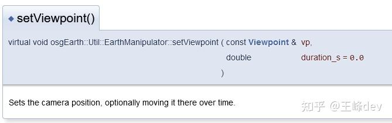
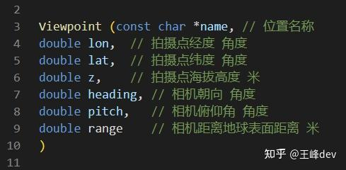
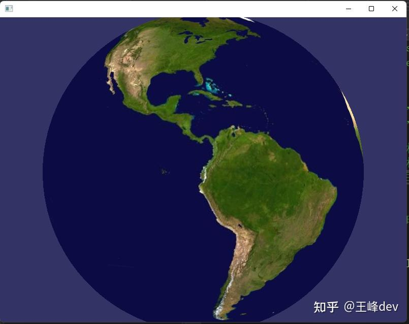
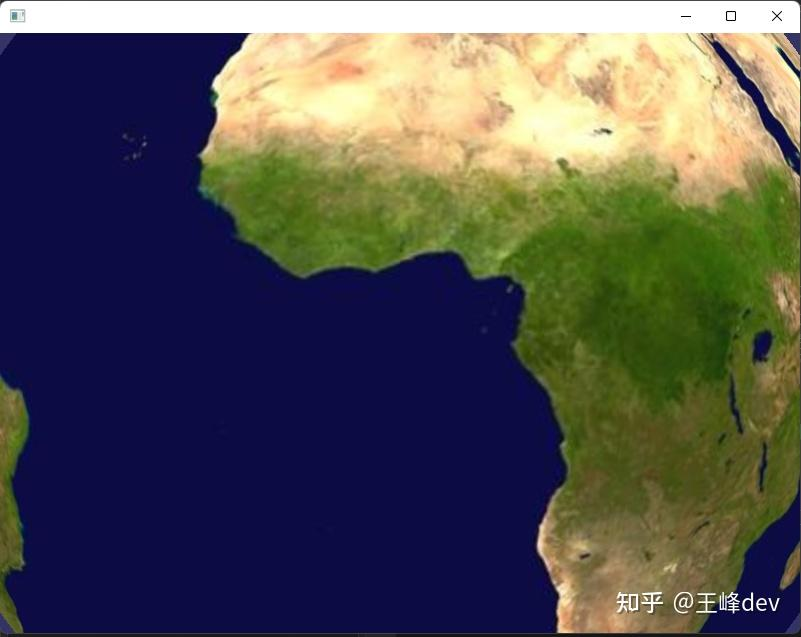
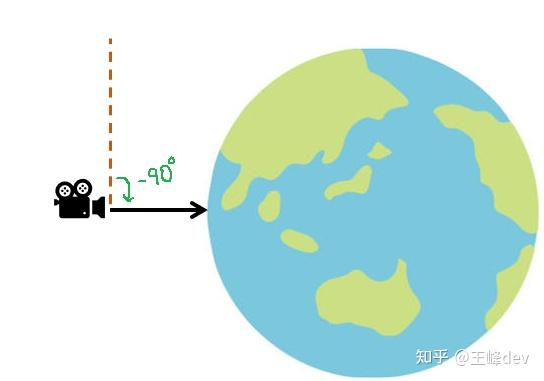
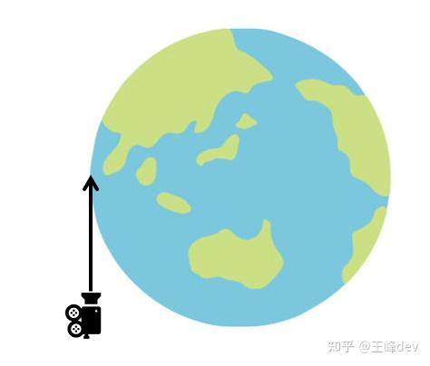
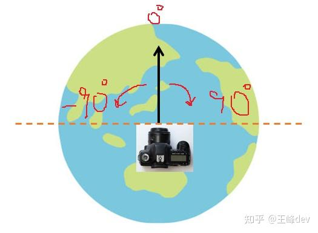

# 1. osgEarth入门13切换相机拍摄点
王峰dev 编辑于 2023-10-06 10:03・日本
https://zhuanlan.zhihu.com/p/659703155

1 **EarthManipulator类**

EarthManipulator类是osgEarth中用于控制相机在三维地球场景中漫游的操作类。最简单的应用就是定位相机观察地表某一个经纬度坐标，函数原型如下：

<figure data-size="normal">
<div>

</div>
</figure>

通过vp控制具体拍摄位置和拍摄姿态。duration控制从前一个相机位置移动到当前设置vp位置的动画时间，单位秒。

**2** **Viewpoint类**

Viewpoint类用于设置相机在地球表面拍摄位置和角度参数。常用构造函数原型如下：

<figure data-size="normal">
<div>

</div>
</figure>

**3** **代码**
 
``` cpp
#include <osgViewer/Viewer>
#include <osgEarth/Notify>
#include <osgEarth/EarthManipulator>
#include <osgEarth/MapNode>
#include <osgEarth/Threading>
#include <osgEarth/ShaderGenerator>
#include <osgDB/ReadFile>
#include <osgGA/TrackballManipulator>
#include <osgUtil/Optimizer>
#include <iostream>
#include <osgEarth/Metrics>
#include <osgEarth/GDAL>
using namespace osgEarth;
using namespace osgEarth::Util;
#include <osgUtil/CullVisitor>
#include <string>
#include <iostream>
using namespace std;
EarthManipulator* g_mp = nullptr;
class MyLayerCullCallBack : public osgEarth::Layer::TraversalCallback
{
public:
    virtual void operator()(osg::Node* node, osg::NodeVisitor* nv) const;
};

void MyLayerCullCallBack::operator()(osg::Node* node, osg::NodeVisitor* nv) const
{
    osgUtil::CullVisitor* cv = dynamic_cast<osgUtil::CullVisitor*>(nv);
    if (cv) {
        osg::Vec3 eye, focal, up;
        cv->getCurrentCamera()->getViewMatrixAsLookAt(eye, focal, up);//获取相机世界坐标
        
        double x = g_mp->getViewpoint().focalPoint()->x();//获取相机焦点经度
        double y = g_mp->getViewpoint().focalPoint()->y();//获取相机焦点纬度

        cout << endl;
    }
    traverse(node, nv);
}
int main()
{
    osgEarth::initialize();
    //create a viewer
    osgViewer::Viewer viewer ;
    viewer.setUpViewInWindow(0, 100, 800, 600);

    // ? why
    viewer.setReleaseContextAtEndOfFrameHint(false);
    
    //set camera manipulator
    EarthManipulator* mp = new EarthManipulator;
    viewer.setCameraManipulator(mp);
    
    // Map is datamodel for collection of layers.
    osg::ref_ptr<osgEarth::Map> rootMap = new osgEarth::Map ;
    
    //GeoTiff Layer
    string worldTifFilename = "D:/codes/osgEarth-Projects/osgearth3.4/data/world.tif";
    osg::ref_ptr<GDALImageLayer> gdalLayer = new GDALImageLayer();
    gdalLayer->setURL(osgEarth::URI(worldTifFilename));
    
    // MapNode is the render or visualization of Map.
    osg::ref_ptr<osgEarth::MapNode> rootMapNode = new osgEarth::MapNode(rootMap.get());
    rootMap->addLayer(gdalLayer);
    viewer.setSceneData(rootMapNode);
    
    //view point
    // Heading in degrees
    // pitch 俯仰角 in degrees
    // range in meters
    Viewpoint vp("demo",
        0,  // 焦点经度 ，单位角度。
        0,  // 焦点维度 ，单位角度。
        0,   // 海拔高度 单位米。
        0,   // Heading 相机指向焦点角度，单位角度。
        -90,   // pitch 相机相对焦点俯仰角度，单位角度。
        1E7 // 距离焦点距离，这里表示距离地表经纬度点的距离，单位米。
    );
    mp->setViewpoint(vp
        , 3  // 相机移动时间，单位秒。
        );
    g_mp = mp;
    gdalLayer->setCullCallback(new MyLayerCullCallBack);
    return viewer.run();
}
```
 
初始拍摄位置：

<figure data-size="normal">
<div>

</div>
</figure>

初始位置在经度-90.0，纬度0.0，相机距离地球表面19,140公里（地球平均半径6,371公里），不知道osgEarth作者为什么选择这个位置。

最终拍摄位置（经度0，纬度0，距离地表10,000 公里）：

<figure data-size="normal">
<div>

</div>
</figure>

**4** **关于相机俯仰角说明**

上面代码设置了俯仰角-90°用于相机垂直类似下面效果：

<figure data-size="normal">
<div>

</div>
</figure>

俯仰角0°效果如下：

<figure data-size="normal">
<div>

</div>
</figure>

**4** **关于相机朝向角（Heading）说明**

相机朝向北极时Heading为0°，向东方向旋转为正角度，向西旋转为负角度。

<figure data-size="normal">
<div>

</div>
</figure>
 

==============================================================
# 2. EarthManipulator实现定位

于 2018-11-20 16:21:35 发布
原文链接：https://blog.csdn.net/yang_sen_/article/details/84304808

本文探讨了在osgEarth中使用三种不同方法进行相机定位的具体实现。
方法一通过设置TetherNode和Viewpoint来锁定相机，但可能影响鼠标操作；
方法二利用Viewpoint设置焦点头部、俯仰和范围，适合根据模型大小调整；
方法三直接设置经纬度、方位角、俯仰角和范围，适用于精确点定位。 
```cpp
    EarthManipulator* em = new EarthManipulator();
    viewer.setCameraManipulator( em );
```

### 方法一
```cpp
    em->setTetherNode( app.geo );

    osgEarth::Viewpoint vp;
    vp.setNode( app.geo );
    vp.heading()->set( -45.0, Units::DEGREES );
    vp.pitch()->set( -20.0, Units::DEGREES );
    vp.range()->set( model->getBound().radius()*10.0, Units::METERS );
    em->setViewpoint( vp );
```
这种方法会锁定相机，导致鼠标左键不能移动。资料说可以解除绑定，具体没详细研究。

### 方法二
```cpp
            Viewpoint vp;
            vp.focalPoint() = GeoPoint(_srs.get(), -90.0, 0, 0, ALTMODE_ABSOLUTE);
            vp.heading()->set( 0.0, Units::DEGREES );
            vp.pitch()->set( -89.0, Units::DEGREES );
            vp.range()->set( _srs->getEllipsoid()->getRadiusEquator() * 3.0, Units::METERS );
            vp.positionOffset()->set(0,0,0);
            em->setViewpoint( vp );
```
这种方法稍微能好些，range需要自己根据模型的大小计算合适的范围。定位模型我使用这个方法。

### 方法三
```cpp
    manip->setViewpoint( Viewpoint(
        "Home",
        -71.0763, 42.34425, 0,   // longitude, latitude, altitude
         24.261, -21.6, 3450.0), // heading, pitch, range
         5.0 );                    // duration
```
这个方法定位模型不是很好，定位一个点效果刚刚的。定位点我使用这个方法。

以上是个人理解，不喜勿喷。
==================================================
# 3. 用EarthManipulator::setViewpoint 实现 平移 旋转 缩放

 `EarthManipulator::setViewpoint` 主要用于设置相机视角，但可以通过不同的参数组合来实现平移、旋转和缩放效果。以下是具体的实现方法：

## 1. 基本设置

首先获取 EarthManipulator 实例：

```cpp
osgEarth::Util::EarthManipulator* manip = dynamic_cast<osgEarth::Util::EarthManipulator*>(_viewer->getCameraManipulator());
if (!manip) return;
```

## 2. 平移（Pan）操作

### 方法一：设置具体的地理坐标
```cpp
#include <osgEarth/GeoData>

// 平移到指定的经纬度高程
osgEarth::Viewpoint vp;
vp.setFocalPoint(osgEarth::GeoPoint(
    osgEarth::SpatialReference::get("wgs84"),
    longitude,  // 经度
    latitude,   // 纬度  
    altitude,   // 高程（米）
    osgEarth::ALTMODE_ABSOLUTE
));
vp.setHeading(0.0);    // 朝向
vp.setPitch(-90.0);    // 俯仰角（-90为垂直向下）
vp.setRange(100000.0); // 视点距离

// 平滑过渡到新视角
manip->setViewpoint(vp, 2.0); // 2秒动画时间

// 立即跳转（无动画）
// manip->setViewpoint(vp);
```

### 方法二：相对平移（基于当前视角）
```cpp
// 获取当前视角
osgEarth::Viewpoint currentVP = manip->getViewpoint();

// 计算新的焦点坐标（相对移动）
double newLon = currentVP.focalPoint().x() + 0.1; // 东移0.1度
double newLat = currentVP.focalPoint().y() + 0.1; // 北移0.1度

osgEarth::Viewpoint newVP;
newVP.setFocalPoint(osgEarth::GeoPoint(
    currentVP.getSRS(),
    newLon, newLat, currentVP.focalPoint().z()
));
newVP.setHeading(currentVP.getHeading());
newVP.setPitch(currentVP.getPitch());
newVP.setRange(currentVP.getRange());

manip->setViewpoint(newVP, 1.0);
```

## 3. 旋转操作

### 水平旋转（改变朝向）
```cpp
// 获取当前视角
osgEarth::Viewpoint vp = manip->getViewpoint();

// 设置新的朝向角度（0-360度，0=北，90=东）
vp.setHeading(vp.getHeading() + 45.0); // 顺时针旋转45度

manip->setViewpoint(vp, 1.0);
```

### 俯仰旋转（改变视角倾斜）
```cpp
osgEarth::Viewpoint vp = manip->getViewpoint();

// 设置俯仰角（-90到0度，-90=垂直向下，0=水平）
vp.setPitch(vp.getPitch() + 15.0); // 抬高视角
vp.setPitch(vp.getPitch() - 15.0); // 降低视角

// 限制俯仰角范围
vp.setPitch(osg::clampBetween(vp.getPitch(), -90.0, 0.0));

manip->setViewpoint(vp, 1.0);
```

## 4. 缩放操作（改变视距）

```cpp
osgEarth::Viewpoint vp = manip->getViewpoint();

// 方法一：直接设置视距
vp.setRange(5000.0); // 缩放到5公里高度

// 方法二：相对缩放
vp.setRange(vp.getRange() * 0.5);  // 放大2倍
vp.setRange(vp.getRange() * 2.0);  // 缩小2倍

// 限制最小最大视距
double minRange = 100.0;   // 最小100米
double maxRange = 10000000.0; // 最大10000公里
vp.setRange(osg::clampBetween(vp.getRange(), minRange, maxRange));

manip->setViewpoint(vp, 0.5);
```

## 5. 组合操作（同时平移、旋转、缩放）

```cpp
// 创建新的视角，同时改变多个参数
osgEarth::Viewpoint newVP;

// 设置新的焦点（平移）
newVP.setFocalPoint(osgEarth::GeoPoint(
    osgEarth::SpatialReference::get("wgs84"),
    116.3974, 39.9093, 0.0  // 北京天安门
));

// 设置朝向（旋转）
newVP.setHeading(45.0); // 东北方向

// 设置俯仰角（旋转）  
newVP.setPitch(-60.0);  // 60度倾斜视角

// 设置视距（缩放）
newVP.setRange(5000.0); // 5公里高度

// 平滑过渡
manip->setViewpoint(newVP, 3.0);
```

## 6. 高级用法

### 围绕特定点旋转
```cpp
// 设置焦点为旋转中心
osgEarth::Viewpoint vp;
vp.setFocalPoint(osgEarth::GeoPoint(srs, centerLon, centerLat, centerAlt));

// 保持固定距离围绕焦点旋转
for (double heading = 0; heading < 360; heading += 10) {
    vp.setHeading(heading);
    manip->setViewpoint(vp, 0.1);
    // 需要添加适当的延迟
}
```

### 飞行路径动画
```cpp
#include <osgEarth/AnnotationUtils>

// 定义路径点
std::vector<osgEarth::GeoPoint> pathPoints;
pathPoints.push_back(osgEarth::GeoPoint(srs, lon1, lat1, alt1));
pathPoints.push_back(osgEarth::GeoPoint(srs, lon2, lat2, alt2));
pathPoints.push_back(osgEarth::GeoPoint(srs, lon3, lat3, alt3));

// 沿路径飞行
for (const auto& point : pathPoints) {
    osgEarth::Viewpoint vp;
    vp.setFocalPoint(point);
    vp.setRange(1000.0);
    vp.setPitch(-45.0);
    
    manip->setViewpoint(vp, 2.0);
    // 需要添加适当的延迟或使用回调
}
```

## 7. 实用工具函数

```cpp
class CameraController {
public:
    static void panTo(EarthManipulator* manip, double lon, double lat, double duration = 2.0) {
        osgEarth::Viewpoint vp = manip->getViewpoint();
        vp.setFocalPoint(osgEarth::GeoPoint(vp.getSRS(), lon, lat, vp.focalPoint().z()));
        manip->setViewpoint(vp, duration);
    }
    
    static void zoomTo(EarthManipulator* manip, double range, double duration = 1.0) {
        osgEarth::Viewpoint vp = manip->getViewpoint();
        vp.setRange(range);
        manip->setViewpoint(vp, duration);
    }
    
    static void rotateTo(EarthManipulator* manip, double heading, double pitch, double duration = 1.0) {
        osgEarth::Viewpoint vp = manip->getViewpoint();
        vp.setHeading(heading);
        vp.setPitch(pitch);
        manip->setViewpoint(vp, duration);
    }
};

// 使用示例
CameraController::panTo(manip, 121.4737, 31.2304, 2.0); // 飞到上海
CameraController::zoomTo(manip, 5000.0, 1.5);          // 缩放到5km
CameraController::rotateTo(manip, 90.0, -45.0, 1.0);   // 转向东，45度俯角
```

## 8. 注意事项

- **动画时间**：较短的动画时间（如0.5秒）适合快速操作，较长的时间（如3秒）适合展示效果
- **边界检查**：确保经纬度在有效范围内（经度-180到180，纬度-90到90）
- **性能考虑**：频繁调用setViewpoint可能影响性能，特别是在移动设备上
- **用户交互**：在动画过程中，用户交互可能会被限制

通过这些方法，您可以灵活地控制EarthManipulator实现各种相机运动效果。