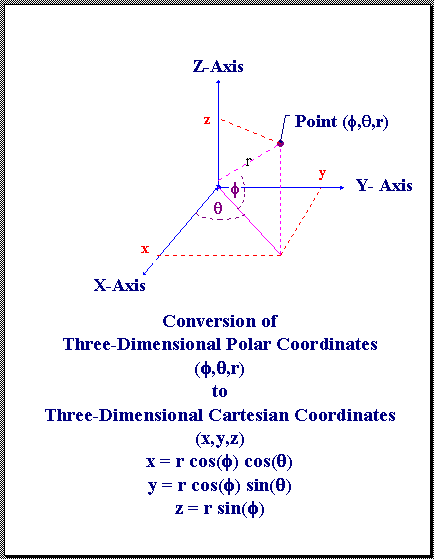
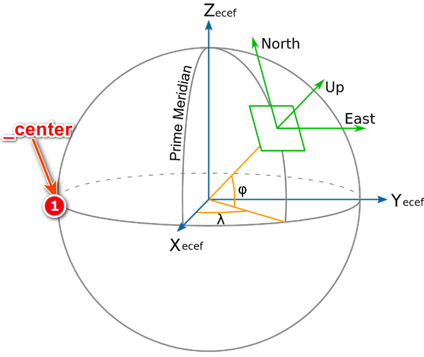

# 浅谈osgEarth操控器类的createLocalCoordFrame函数如何将局部坐标系的点转为世界坐标系下的Martix（ENU坐标）
「荆楚闲人」 已于 2023-05-07 19:23:42 修改
原文链接：https://blog.csdn.net/danshiming/article/details/130524139

本文详细解析了osgEarth中的EarthManipulator类如何处理坐标变换，特别是从地心地固坐标到经纬度高程坐标再到局部坐标系（ENU）的过程。通过`setLookAt`和`createLocalCoordFrame`函数，展示了如何构建旋转和平移矩阵，以确定视角在三维空间中的位置和姿态。
 
 在osgEarth操控器类的EarthManipulator中的如下函数：
```cpp
void EarthManipulator::setLookAt(const osg::Vec3d& center,
                            double            azim,
                            double            pitch,
                            double            range,
                            const osg::Vec3d& posOffset)
{
    setCenter( center );
    .... // 其它代码略
}
 
void EarthManipulator::setCenter( const osg::Vec3d& worldPos )
{
    _center = worldPos;
    createLocalCoordFrame( worldPos, _centerLocalToWorld );
    .... // 其它代码略
}
```
如上代码在osgEarth操控器EarthManipulator类的setLookAt函数调setCenter函数设置相机视点看向的位于**地球上的某焦点区域的中心_center**。**_center是世界坐标系表示的点**，也即是地心地固坐标系表示的点。setCenter函数调用createLocalCoordFrame函数，其代码如下：
```cpp
bool
EarthManipulator::createLocalCoordFrame( const osg::Vec3d& worldPos, osg::CoordinateFrame& out_frame ) const
{
    if ( _srs.valid() )
    {
        osg::Vec3d mapPos;
        _srs->transformFromWorld( worldPos, mapPos );
        _srs->createLocalToWorld( mapPos, out_frame );
    }
    return _srs.valid();
}
```
其中： 
```cpp
_srs->transformFromWorld( worldPos, mapPos );
```
是将地心地固坐标系表示的点worldPos 转为 **经度、纬度、高程坐标系**(一般为WGS84)下的点，并保存到mapPos变量中。按上面的调用流程来看，就是将**_center**转为**经纬度、高程坐标系下**的坐标，并保存到mapPos变量中。如下代码：
```cpp
_srs->createLocalToWorld( mapPos, out_frame );
```
将mapPos变即最开始的_center转为经纬度高程后的坐标再转为out_frame。上述createLocalToWorld函数到底是干什么用的呢？断点跟踪到底层代码：
```cpp
bool
SpatialReference::createLocalToWorld(const osg::Vec3d& xyz, osg::Matrixd& out_local2world ) const
{
    if (!valid())
        return false;
 
    if ( isProjected() && !isCube() )
    {
        ....// 其它代码略
    }
    else if ( isGeocentric() )
    {
        ....// 其它代码略
    }
    else
    {
        // convert to ECEF:
        osg::Vec3d ecef;
        if ( !transform(xyz, getGeocentricSRS(), ecef) )
            return false;
 
        // and create the matrix.
        out_local2world = _ellipsoid.geocentricToLocalToWorld(ecef);
    }
    return true;
}
```
 在else语句中又将经纬度、高程坐标系下的_center转回地心地固坐标，接下来通过geocentricToLocalToWorld将这个地心地固坐标下的_center进行转换：
 ```cpp
 osg::Matrix
Ellipsoid::geocentricToLocalToWorld(const osg::Vec3d& geoc) const
{
    osg::Matrix m;
    EM.computeLocalToWorldTransformFromXYZ(geoc.x(), geoc.y(), geoc.z(), m);
    return m;
}
```
发现上述代码调用了osg里面的函数：
```cpp
inline void EllipsoidModel::computeLocalToWorldTransformFromXYZ(double X, double Y, double Z, osg::Matrixd& localToWorld) const
{
    double  latitude, longitude, height;
    convertXYZToLatLongHeight(X,Y,Z,latitude,longitude,height);
  
    localToWorld.makeTranslate(X,Y,Z);
    computeCoordinateFrame(latitude, longitude, localToWorld);
}
```
这个函数前面很简单：又将地心地固坐标的_center转成经纬度、高程坐标系坐标；这个函数后面断点跟进去如下：

```cpp
inline void EllipsoidModel::computeCoordinateFrame(double latitude, double longitude, osg::Matrixd& localToWorld) const
{
    // Compute up vector
    osg::Vec3d    up      ( cos(longitude)*cos(latitude), sin(longitude)*cos(latitude), sin(latitude));
    // Compute east vector
    osg::Vec3d    east    (-sin(longitude), cos(longitude), 0);
    // Compute north vector = outer product up x east
    osg::Vec3d    north   = up ^ east;
    // set matrix
    localToWorld(0,0) = east[0];
    localToWorld(0,1) = east[1];
    localToWorld(0,2) = east[2];
 
    localToWorld(1,0) = north[0];
    localToWorld(1,1) = north[1];
    localToWorld(1,2) = north[2];
 
    localToWorld(2,0) = up[0];
    localToWorld(2,1) = up[1];
    localToWorld(2,2) = up[2];
}
```

可以看出，上面这个函数就是生成了一个旋转矩阵，再结合上面的那个平移的代码：
```cpp
localToWorld.makeTranslate(X,Y,Z);
```

可以看出，生成的这个矩阵是一个旋转平移矩阵。而且是先旋转，后平移。 上面坐标结合下图很容易理解：
 
        图1 坐标转换图 

 经过这么多转换后，_center向东、向北，向天方向的姿态就出来了，如下：

 
 图2 ECEF、ENU、BLH坐标系

 淡绿色坐标系为东北天(ENU)坐标系，经过这么多次转换后，_center就相当于三个淡绿色坐标系的原点（说明：在osgEarth操控器中，程序初始流程刚进入时，_center其实是位于图2中的1位置处，即地心地固坐标系Y轴负半轴和赤道圆交点处，这里为了便于观察，将ENU放到易于观察的角度了）。另外：图2中灰色的X、Y、Z轴表示的地心地固坐标系(ECEF)，桔黄色表示的是经纬度坐标系（BLH）。

  地心地固坐标系和ENU坐标系之间的换算，可以参考如下博文：
[地心地固坐标系(ECEF)与站心坐标系(ENU)的转换](https://blog.csdn.net/danshiming/article/details/130219128?spm=1001.2014.3001.5502)。
 
=================================================
# EarthManipulator::setByMatrix() 和 EarthManipulator::getMatrix() const ？？？
