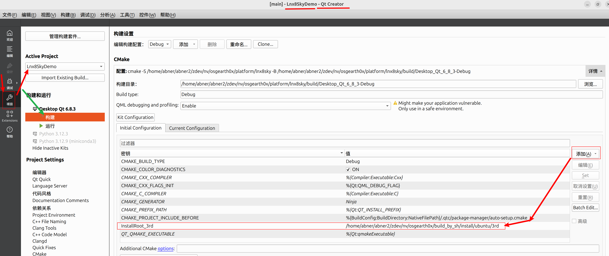

# about this demo code 
 
 refer to  [osgEarth入门22简单天空模型](https://zhuanlan.zhihu.com/p/676540210) 

# osgearth代码中的下面的demo的CMakeLists.txt已经被适配为static lib模式
>  3rd/osgearth/src/applications/osgearth_skyview/CMakeLists.txt
>  3rd/osgearth/src/applications/osgearth_city/CMakeLists.txt

特别是 osgearth_skyview/CMakeLists.txt，适配得最完全，可以作为改造其他demo的模板使用。

# qtcreator 中运行 plain c++ 程序，如何给 cmakelists.txt 传递 参数 

 

# qtCreator 中导入 过程中产生的 "build/Desktop_Qt_6_8_3-Debug"文件夹 和 CMakeLists.txt.user 文件 都应加入 .gitignore
qtCreator 中导入 带有 cmakelists.txt 的 plain c++ 程序， 导入过程中产生的 "build/Desktop_Qt_6_8_3-Debug"文件夹 和 CMakeLists.txt.user 文件 都应加入 .gitignore。

